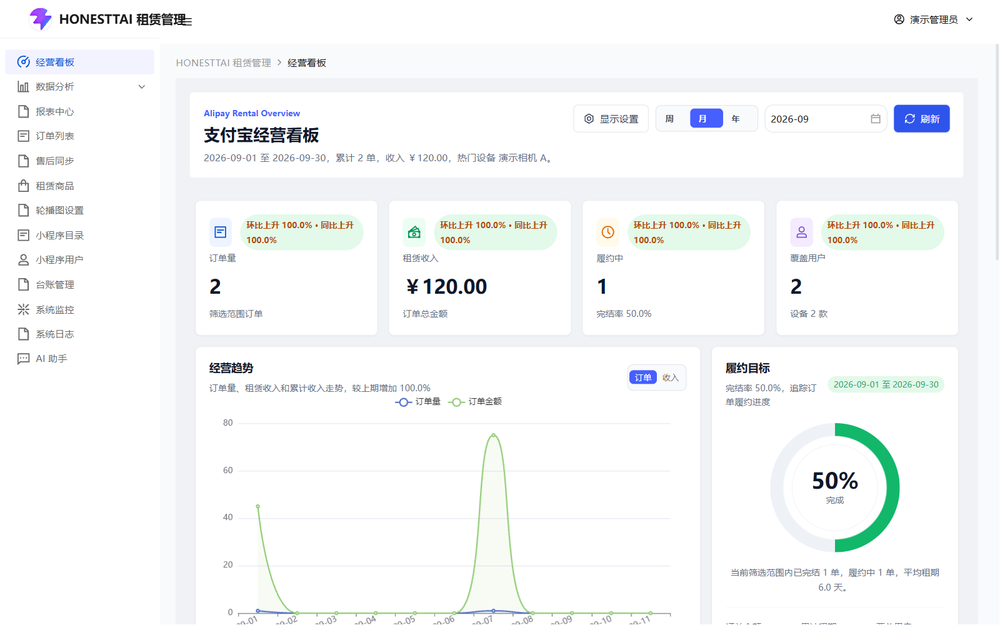
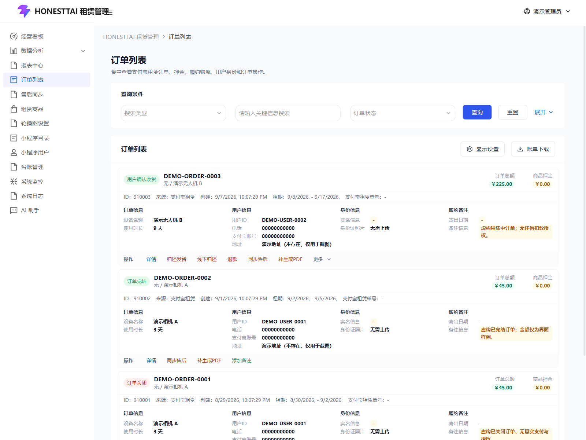
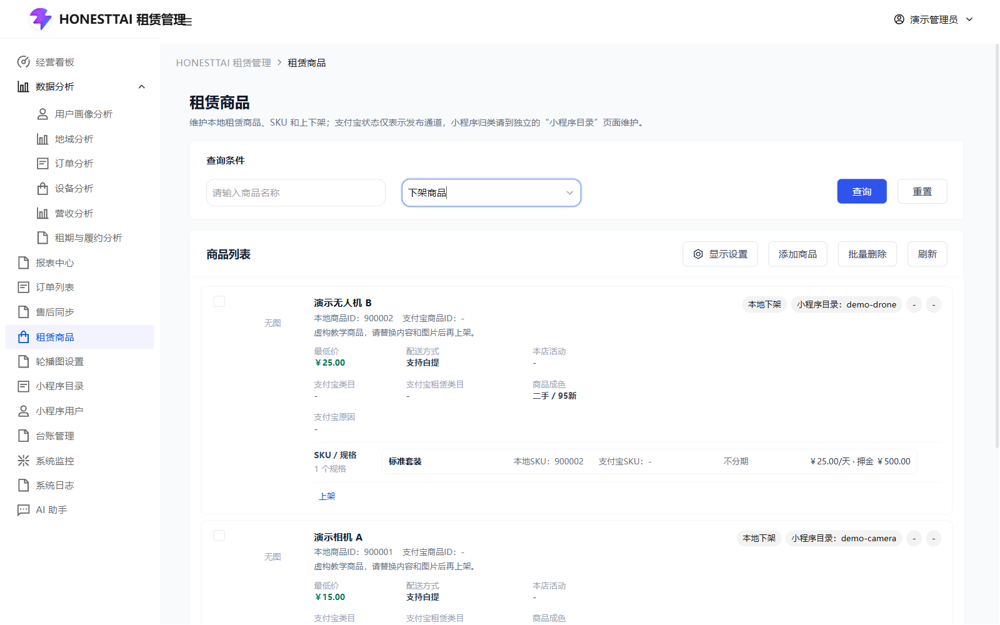
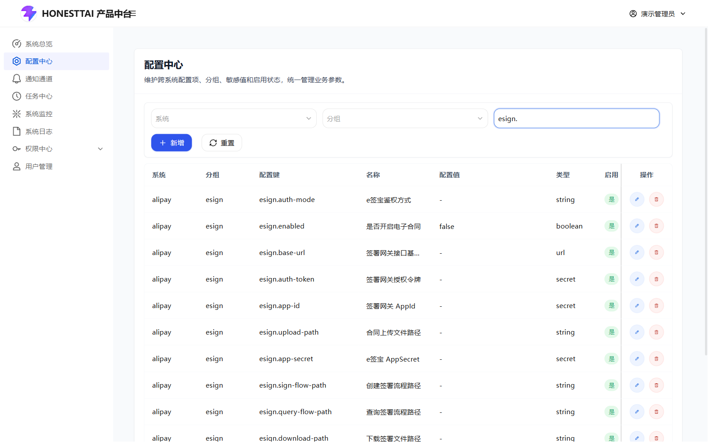

<div align="center">

**English** · [简体中文](README.zh-CN.md)

[HRouter](https://hrouter.net/home) · [All public projects](https://github.com/honestTai) · [Star & Fork trends](#project-activity)

</div>

[](#project-activity)

# Rent Project

**Bring rental products, orders, contracts, and fulfillment together.**

A rental operations system for teams and developers working with Alipay rental workflows and electronic contracts. Organize products, orders, installment bills, contracts, and business analytics with shared access and configuration management.

**Included:** server code, two web applications, database structure, and initialization tools. **Not included:** the Alipay Mini Program frontend. External services require your own authorized applications, credentials, and configuration.

[Visual tour](docs/SHOWCASE.md) · [User guide](docs/USER_GUIDE.md) · [Deployment](docs/DEPLOYMENT.md) · [Releases](https://github.com/honestTai/rent-project/releases/latest)

## Capabilities

| Area | What is included |
| :--- | :--- |
| Rental integrations | Alipay rental components, credit-based deposit workflows, product synchronization, and order/after-sales notifications |
| Electronic contracts | eSign integration, agreement PDFs, OAuth2 flows, signing, signed-document lookup, and contract submission |
| Installments and withholding | Bill records, agreement callbacks, and scheduled deduction tasks; subject to merchant capability, valid orders, user authorization, and configuration |
| Fulfillment | Shipping, receipt, returns, buyout, deposit adjustments, and compensation records |
| Shared platform | Users, roles, menus, button/API permissions, configuration, notifications, tasks, and logs |
| Analytics | User, geography, order, device, revenue, and rental-fulfillment analysis; periodic reports and exports |
| Optional AI workspace | Read-only business queries, analysis, and reports through a separately deployed Agent service |

**Important boundaries:** the administrative interface's proactive agreement-signing entry is currently disabled. Demo environments also disable signing and deduction tasks. Platform API availability depends on application authorization, merchant/category qualifications, and configuration. See the [integration guide](docs/manual/INTEGRATIONS.md) for prerequisites and interface boundaries.

## Product tour

The screenshots below use **fictional data in an isolated local demo**. They are not evidence of real transactions, signatures, or business performance. The user guide covers 33 pages and their controls, filters, dialogs, and operating conditions.

**Business dashboard** — orders, revenue, devices, and fulfillment by period.



**Order operations** — fulfillment, deposits, agreements, installment bills, and after-sales.



**Product management** — products, SKUs, images, and synchronization records.



**eSign configuration** — signing modes, callbacks, and application parameters.



## Get started

### Release deployment

Download a Docker release package and its matching `SHA256SUMS` from [Releases](https://github.com/honestTai/rent-project/releases), verify it, and follow the [deployment, upgrade, and rollback guide](docs/DEPLOYMENT.md). Packages include the backend JAR and both frontends, so server-side compilation is not required.

The documented installation environment uses Linux, Python 3.10+, Docker Engine, and Compose 2.20+, with independent MySQL 8 / Redis and local-only entry points by default. Initial image retrieval needs network access. External MySQL / RDS is also supported. See [SECURITY.md](SECURITY.md) for credential handling and reporting.

### Source development

Prepare JDK 8 or a compatible JDK, Maven 3.6+, Node.js 22, MySQL 8, Redis, and Python 3.10+ for initialization and the optional Agent.

```bash
git clone https://github.com/honestTai/rent-project.git
cd rent-project
python -m pip install -r customer-deploy/scripts/requirements-init.txt
```

Follow [initialization](docs/INITIALIZATION.md) to set independent deployment keys and create a **new empty database**. Set the administrator password yourself; there is no shared default password. The optional `--demo` mode is only for isolated local use: records are marked DEMO, contain no real payment authorization, and all scheduled tasks default to disabled.

```bash
mvn -B -ntp test package
cd equipment_management_system_fornt
npm ci
```

Follow the [quick start](docs/QUICKSTART.md) for database/Redis configuration and startup order: registry, shared platform, rental service, gateway, and both web apps. Default local entries are `http://localhost:8084` (platform) and `http://localhost:8083` (rental operations). Use your own HTTPS reverse proxy for an appropriate deployment.

## Documentation

The linked detailed guides are primarily in Chinese; the English overview does not replace their setup and safety instructions.

- [Visual tour](docs/SHOWCASE.md) and [33-page user guide](docs/USER_GUIDE.md)
- [Quick start](docs/QUICKSTART.md) and [initialization](docs/INITIALIZATION.md)
- [Alipay, eSign, and withholding integrations](docs/manual/INTEGRATIONS.md)
- [Architecture](docs/ARCHITECTURE.md), [deployment](docs/DEPLOYMENT.md), and [official references](docs/REFERENCES.md)
- [Public-content review record](docs/SECURITY_REVIEW.md) — scoped documentation, not an application security audit
- [Contributing](CONTRIBUTING.md) and [security](SECURITY.md)

## License and services

Project-owned code uses [AGPL-3.0-only](LICENSE). Consult the full license for use, modification, distribution, and network-service obligations; preserve third-party licenses in [NOTICE](NOTICE) and [THIRD_PARTY_NOTICES.md). When deploying modifications, point the frontend's `VITE_SOURCE_URL` to the corresponding source of the version you run. Infrastructure, storage, and third-party API costs are yours.

Maintained by [honestTai](https://github.com/honestTai). Use Issues for feedback or [email](mailto:honest.tai@outlook.com) for deployment, training, and customization. The author's separate [HRouter](https://hrouter.net/home) service is **not a purchase requirement** for using or deploying this rental system.

---

<a id="project-activity"></a>

## Project activity

Star / Fork totals and retained-event history, scheduled to refresh daily.

[](https://github.com/honestTai/honestTai/blob/main/data/README.md)

[Observed daily totals](https://raw.githubusercontent.com/honestTai/honestTai/main/assets/metrics/rent-project-daily.svg) · [Methodology](https://github.com/honestTai/honestTai/blob/main/data/METHODOLOGY.md) · [All public projects](https://github.com/honestTai)

<sub>Historical curves reconstruct currently retained stars and visible forks, not historical net totals. Separate daily observations start on 2026-10-06; no fabricated backfill.</sub>
