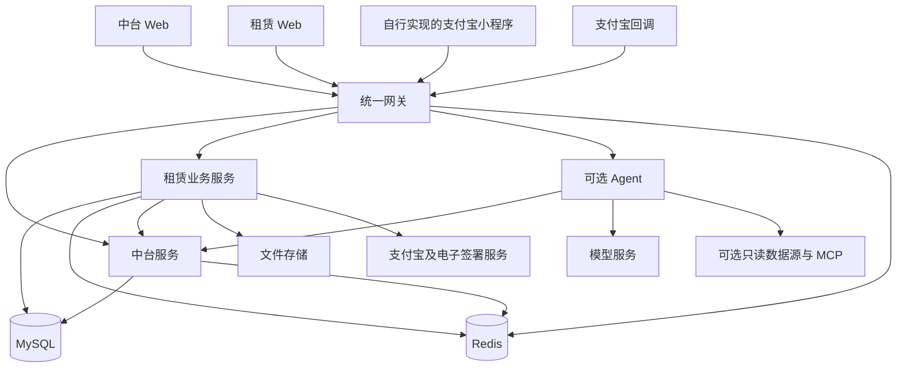

# 架构说明

本仓库包含统一中台、支付宝租赁业务、两个 Web 后台和可选的只读分析 Agent。模块清单以当前源码为准。

Eureka 提供 Java 服务注册发现；本地配置也包含固定服务地址。部署方应统一选择运行配置，确保前端请求进入正确的网关。

## 模块职责

| 目录 | 职责 |
| --- | --- |
| `equipment-common` | 统一响应、登录辅助、Redis、OSS、中台配置和通知客户端、日志公共能力 |
| `equipment-eureka` | Java 服务注册发现 |
| `equipment-gateway` | 后台统一登录、登录态验证、用户上下文、RBAC 和 API 路由 |
| `equipment-platform` | 后台用户、角色权限、配置、通知通道、任务配置、监控和日志 |
| `equipment-alipay` | 租赁商品、目录、订单、账单、合同、押金、售后、分析、报表、小程序接口及回调 |
| `equipment-agent` | 独立 Python 服务，提供 AI 对话、只读业务工具、可选 SQL 和 MCP 能力 |
| `equipment_management_system_fornt/apps/platform-tdesign` | Vue 中台后台 |
| `equipment_management_system_fornt/apps/rent-tdesign` | Vue 租赁运营后台 |
| `equipment_management_system_fornt/shared` | 两个后台复用的 Agent 界面和协议 |
| `customer-deploy` | 部署、反向代理、初始化等交付文件 |

代码中的历史模块名称、兼容适配器或测试数据不表示相关完整业务系统已包含在仓库。当前没有独立设备出租后台、二手交易后台、iOS 客户端和支付宝小程序前端源码。

## API 与本地端口

| 入口 | 归属 | 默认本地端口 |
| --- | --- | --- |
| 后台登录 `/api/login/login` | 网关 | `7777` |
| `/api/platform/**`、`/api/user/**` | 中台 | `7780` |
| `/api/web/**` | 租赁运营接口 | `7781` |
| `/api/rent/v1/**` | 小程序接口 | `7781` |
| `/notify/**` | 支付宝等回调入口 | `7781` |
| `/api/agent/**` | 可选 Agent | `7790` |
| 服务注册中心 | Eureka | `8761` |
| 中台 Web 开发入口 | `npm run dev:platform` | `8084` |
| 租赁 Web 开发入口 | `npm run dev:rent` | `8083` |

后台和小程序 API 对外统一经过网关。表中业务服务端口用于本地理解，不是要求部署时全部暴露到公网。不同运行 profile 和部署配置可以使用不同端口。

## 三条主要业务链路

**后台访问：**浏览器登录网关，网关验证中台用户和登录态；前端根据角色生成菜单与按钮，网关按接口权限检查业务请求。修改授权后用户需要重新登录。

**商品和订单：**运营后台维护本地商品与 SKU，租赁服务通过支付宝接口同步商品。自行实现的小程序调用本仓库交易接口创建订单，后端处理支付、冻结和订单回调；运营人员再通过后台执行审核、履约与售后。支付宝侧状态和本地状态需要通过回调及查询同步保持一致。

**配置和定时任务：**中台维护参数，租赁服务通过中台客户端读取。任务中心保存既有任务的启停与 Cron，业务服务持有具体实现并轮询配置；新增任意任务配置不会自动增加可执行代码。电子合同、自动代扣、通知和 AI 还受各自能力配置控制。

## 数据与可选外部依赖

MySQL 保存业务数据和中台主数据；Redis 保存登录态、缓存、锁及幂等状态。文件存储保存图片和协议文件。支付宝应用、电子签署、通知、AI 模型和 MCP 需要部署方自行配置，初始化 SQL 不附带可用于真实商户业务的授权。

Agent 支持通过网关进行只读业务查询，也支持专用只读数据库连接。它是独立服务；菜单可见不会使 Python 服务自动启动。详细运行要求见 [Agent 说明](../equipment-agent/README.md)。

## 维护时从哪里开始

| 问题 | 先检查 |
| --- | --- |
| 菜单或按钮消失 | 前端路由/权限 store → 中台用户角色和权限资源 → 网关 RBAC |
| 配置缺失 | `platform_config` 中系统编码与配置键 → 中台客户端 → 业务能力配置读取 |
| 支付、押金、售后状态不一致 | 回调控制器 → 业务服务 → 订单/账单/售后记录 → 运营台账 |
| 商品同步失败 | 商品界面 → 商品控制器 → 同步实现及同步日志 → 外部返回原因 |
| 定时任务不执行 | 中台任务记录 → `ScheduledTasks` → `ZhongtaiScheduleTaskService` → 服务日志 |
| AI 不可用 | 网关路由 → Agent 健康和模型配置 → 工具权限及外部依赖 |

路由依据见 [网关配置](../equipment-gateway/src/main/resources/application.yml)，后台入口依据见 [中台菜单](../equipment_management_system_fornt/apps/platform-tdesign/src/router/modules/platform.ts) 和 [租赁菜单](../equipment_management_system_fornt/apps/rent-tdesign/src/router/modules/alipay.ts)。业务操作步骤见 [操作手册](USER_GUIDE.md)。
