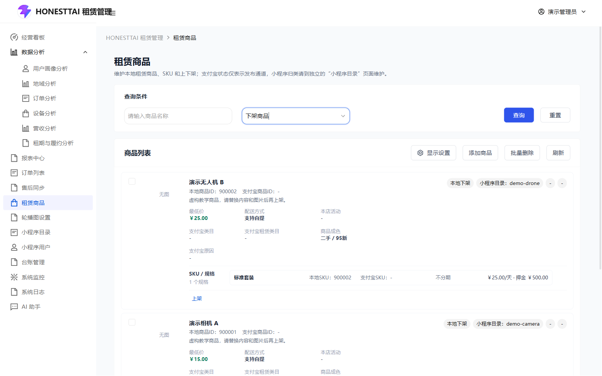
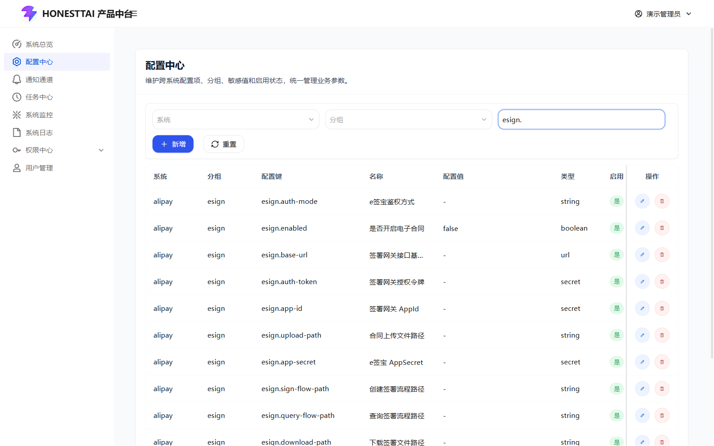

# Rent Project · 图文导览 / Visual tour

**先看主要页面，再决定是否部署。**  
**Explore the key screens before deploying.**

[项目首页 / Overview](../README.md) · [完整操作手册 / User guide](USER_GUIDE.md) · [部署说明 / Deploy](DEPLOYMENT.md) · [下载部署包 / Releases](https://github.com/honestTai/rent-project/releases/latest)

这份导览使用仓库已有的本地隔离环境截图，展示的是虚构演示数据，不是在线体验账号或真实经营结果。项目包含服务端与两个 Web 应用，不包含支付宝小程序前端。

This tour uses existing screenshots from an isolated local environment with fictional demo data. It is a visual guide, not a live account or evidence of business results. The repository includes server code and two web apps, not the Alipay Mini Program frontend.

## 1. 商品管理 · Product catalog

查看商品、SKU、图片与支付宝同步记录，了解租赁商品如何进入运营流程。  
Review products, SKUs, images, and Alipay synchronization records.

[商品模块操作说明 / Catalog guide](manual/CATALOG.md)

## 2. 订单与履约 · Orders & fulfillment

从订单列表了解合同、分期账单、押金与履约状态，再按具体订单进入处理流程。  
Inspect contract, installment, deposit, and fulfillment information before working on an individual order.

[订单与履约说明 / Order guide](manual/ORDERS.md)

## 3. 电子签约接入 · E-signing configuration

查看 e签宝配置页面，了解签署模式、回调和应用参数的配置位置。实际签署需要相应应用、权限和业务条件。  
Explore where signing mode, callbacks, and application parameters are configured. Actual signing requires the relevant application setup, permissions, and business conditions.

[支付宝、电子签约与代扣说明 / Integration guide](manual/INTEGRATIONS.md)

## 4. 经营看板 · Operations dashboard

按周期查看订单、收入、设备与履约数据，从业务处理进入经营分析。  
Review orders, revenue, devices, and fulfillment over a selected period.

[分析模块说明 / Analytics guide](manual/ANALYTICS.md)

## 下一步 · Next steps

- **先了解细节 / Learn more**：[逐页操作手册 / Full user guide](USER_GUIDE.md)。
- **部署与试用 / Deploy**：[部署指南 / Deployment guide](DEPLOYMENT.md)；初始化与演示数据见 [INITIALIZATION.md](INITIALIZATION.md)。
- **开发与定制 / Customize**：[快速开始 / Quick start](QUICKSTART.md) · [架构说明 / Architecture](ARCHITECTURE.md)。
- **交流 / Contact**：[项目 Issues](https://github.com/honestTai/rent-project/issues) · [邮件 / Email](mailto:honest.tai@outlook.com)。
