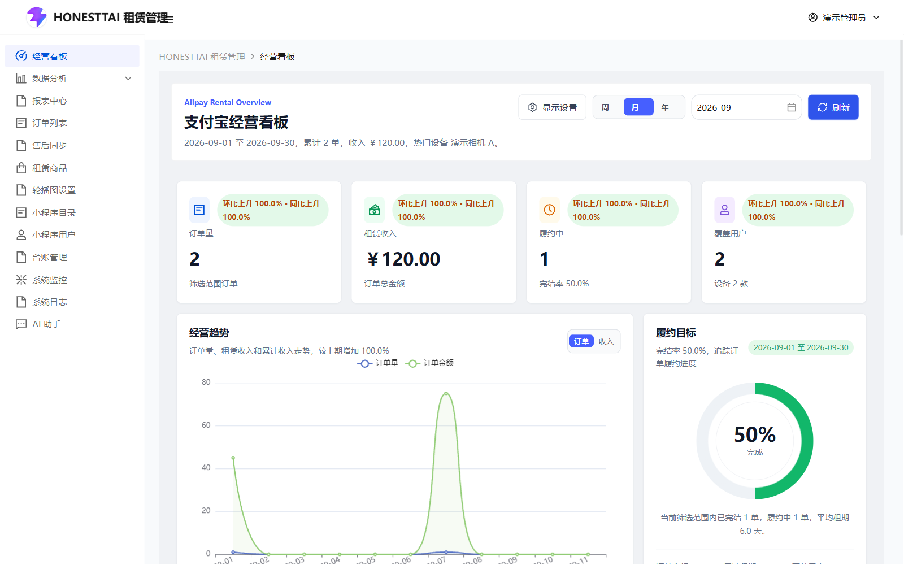
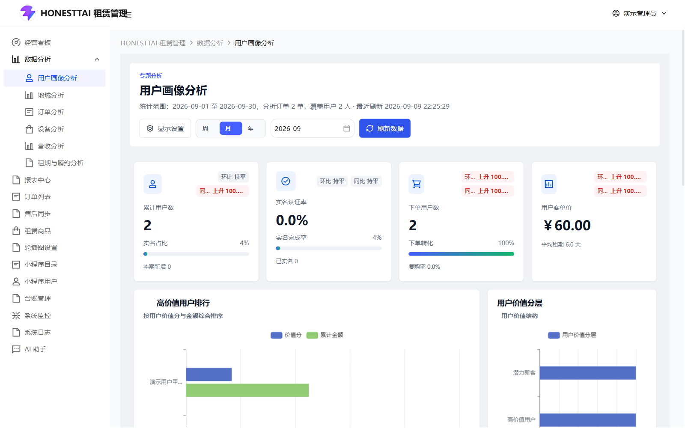
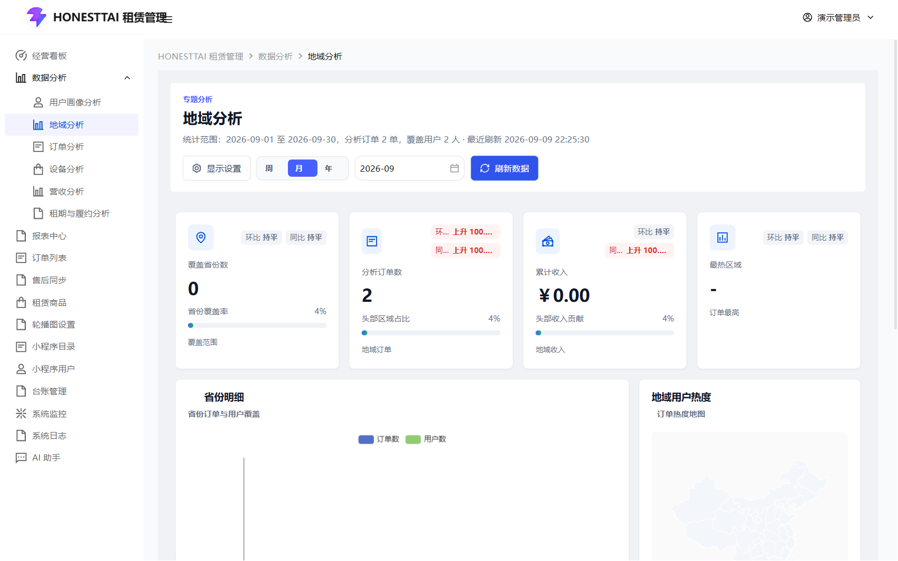
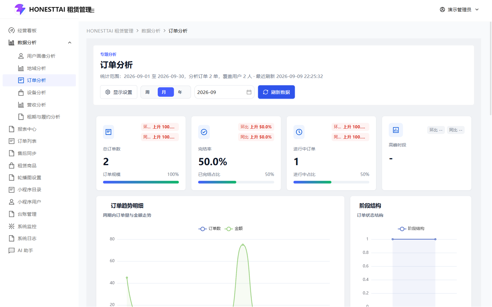
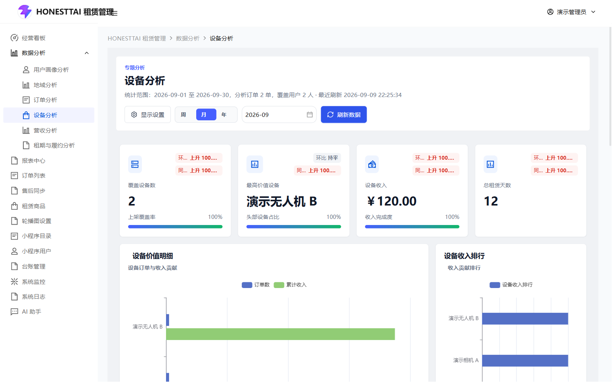
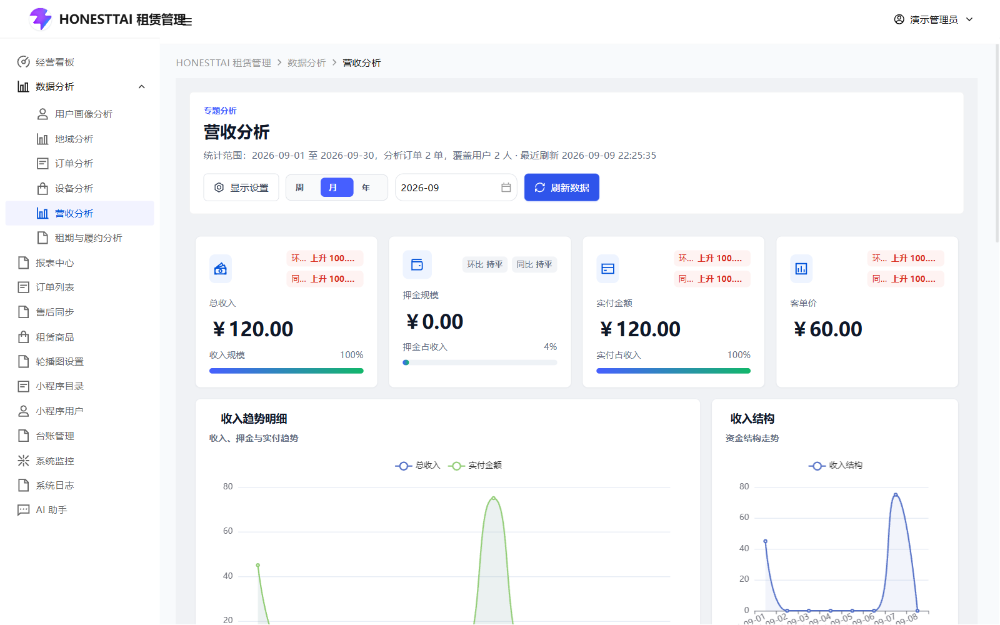
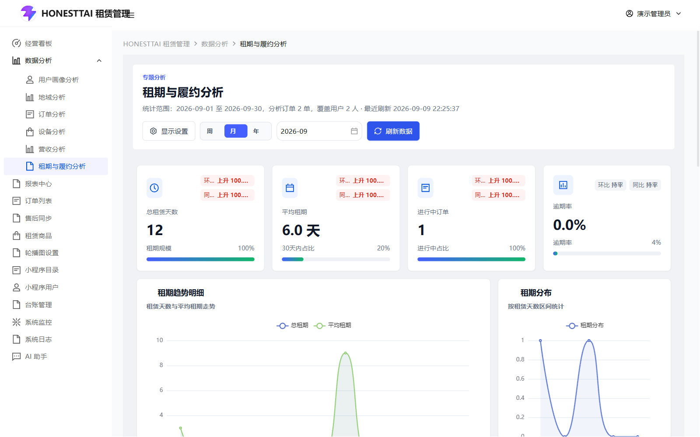
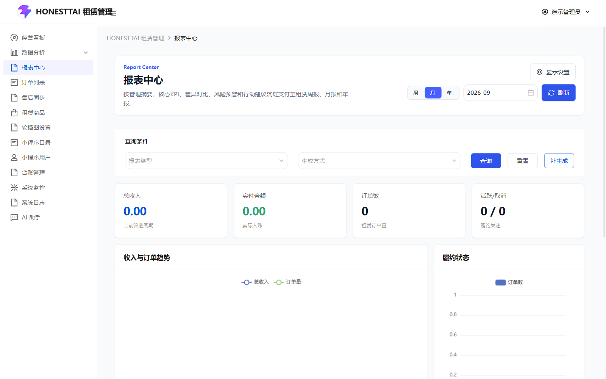
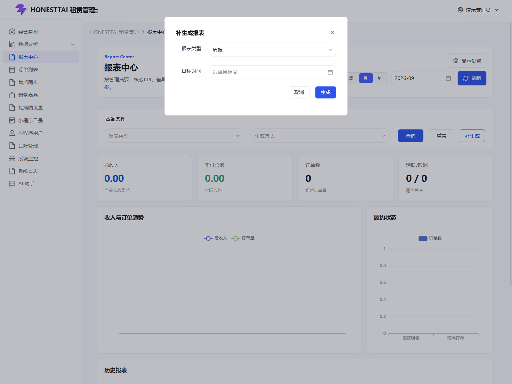

# 经营看板、专题分析与报表

[返回操作手册](../USER_GUIDE.md) · [订单与售后](ORDERS.md)

本章覆盖经营看板、六个专题与报表中心共 8 页。每页截图均使用本地演示数据，不能作为真实经营业绩。页面数据来源和周期以当前后端响应为准。

## 1. 所有分析页共用的时间选择

| 控件 | 操作 |
| --- | --- |
| 周 / 月 / 年 | 切换统计周期，同时切换日期选择器形态。周范围从周一开始，月从当月 1 日开始，年从当年 1 月 1 日开始。 |
| 日期选择器 | 选择要分析的周、月或年；更换后重新加载对应周期。不是任意起止日期组合。 |
| 刷新 / 刷新数据 | 重新取当前周期数据；经营看板显示“刷新”，专题显示“刷新数据”。 |
| 显示设置 | 勾选需要显示的模块，用上移/下移调整顺序，保存设置；恢复当前默认只重置当前分类。 |
| 图表 | 鼠标移到数据点/图形上查看提示。图例支持的交互由图表类型决定，不能把图表点击当作订单修改。 |
| 明细表分页 | 使用页码、每页条数查看明细。金额列与数量/天数列分别读取。 |

六个专题页没有额外的“省份筛选”“设备筛选”或通用“查询 / 重置”按钮；它们使用周期、日期和“刷新数据”。无数据时显示空状态，先检查周期和业务记录，再检查接口错误。

## 2. 经营看板 `/alipay/dashboard`

看板由关键指标、经营趋势/履约目标、状态与租期分布、热门设备/运营洞察、近期订单/地域排行组成。“显示设置”可控制这些模块的显示和顺序。

| 交互 | 使用方法 |
| --- | --- |
| 周 / 月 / 年、日期、刷新 | 按本章共用时间选择说明操作，刷新后核对顶部范围提示。 |
| 经营趋势：订单 / 收入 | 切换趋势图的订单或收入指标，不修改底层订单。 |
| 热门设备：订单 / 金额 / 天数 | 按订单数、累计金额或租赁天数重新排列热门设备。 |
| 设备分析 | 跳转设备专题；只有具有分析页权限且路由存在时显示。 |
| 用户画像 / 地域分析 / 订单分析 / 设备分析 / 营收分析 / 租期履约 | 运营洞察下方的快捷入口，按权限显示并跳转对应专题。 |
| 近期订单分页 | 查看当前加载的近期订单明细；订单名称和订单号用于识别记录。 |
| 显示设置 | 调整看板模块，保存后生效。 |

履约目标是依据当前订单汇总显示的进度，并没有修改经营目标的表单。当前看板也没有可点击的财务报告导出入口；导出周期报告应使用报表中心。

## 3. 用户画像分析 `/alipay/analysis/user-portrait`

使用顶部周/月/年、日期、“刷新数据”和“显示设置”。页面展示用户规模、实名认证率、下单用户和客单价等卡片；高价值用户排行同时观察价值分与累计金额，用户价值分层展示用户结构。

明细表包含用户、地域、实名状态、订单数、累计金额、客单价、平均租期和占比。使用分页逐页查看。补充模块包含注册与地域相关明细，是否显示取决于响应数据和显示设置。本页没有编辑用户资料或封禁按钮；用户管理见 [运营支持](OPERATIONS.md)。

## 4. 地域分析 `/alipay/analysis/region`

使用顶部共用周期控件、“刷新数据”和“显示设置”。页面展示覆盖省份、订单量、累计收入、最热区域；省份对比查看订单数与用户数，地图展示地域热度。

省份明细含省份、订单数、收入、用户数、平均客单价、平均租期和订单占比，按分页查看。补充模块可查看收入或订单领先区域。地图是统计展示，当前没有通过地图修改订单地址的操作，也没有单独省份筛选表单。

## 5. 订单分析 `/alipay/analysis/order`

使用周/月/年、日期、“刷新数据”和“显示设置”。卡片展示总订单数、完结率、进行中订单、高峰时段；主图查看周期内订单量和金额走势，阶段结构查看状态分布。

趋势明细包含日期、订单数、订单金额、总租期、平均租期和占比；补充模块包含小时与星期分布。分页查看明细，本页不提供关闭、退款或履约操作。需要处理某单时进入 [订单列表](ORDERS.md)。

## 6. 设备分析 `/alipay/analysis/device`

使用共用周期控件、“刷新数据”和“显示设置”。卡片展示覆盖设备、最高价值设备、设备收入、总租赁天数；设备价值对比订单与金额，设备收入排行查看贡献。

明细包含设备名称、订单数、累计收入、租赁天数、平均租期和收入占比，支持分页；补充模块按订单、收入和租赁天数展示排行。本页是经营分析，不提供新增设备、库存修改或商品上下架。

## 7. 营收分析 `/alipay/analysis/revenue`

使用共用周期控件、“刷新数据”和“显示设置”。卡片分别显示总收入、押金规模、实付金额、客单价；趋势与结构模块展示不同资金指标。

明细包含日期、总收入、押金规模、实付金额和占比，可分页查看；补充模块展示资金构成。**押金和预授权额度不是可直接认定的租金收入，页面中的“实付金额”也不等同于财务利润。** 对账时结合订单、资金回调和支付侧账单，不能只相加卡片数值。

## 8. 租期与履约分析 `/alipay/analysis/rental`

使用共用周期控件、“刷新数据”和“显示设置”。卡片展示总租赁天数、平均租期、进行中订单、逾期率；趋势查看总租期与平均租期，分布查看不同租期区间。

趋势明细含日期、总租期、平均租期和占比，支持分页；补充履约模块展示后端返回的履约指标。统计中发现异常后，到订单页核对实际归还与签收记录，本页不提供“确认归还”按钮。

## 9. 报表中心 `/alipay/reports`

报表中心读取已生成的周报、月报和年报。历史报表是生成时的周期记录，生成时间与实时数据不同可能导致数值差异。

| 控件/按钮 | 操作与结果 |
| --- | --- |
| 周 / 月 / 年及日期 | 切换历史列表的统计范围，更换后重新查询。 |
| 刷新 | 重新读取当前查询条件下的报表。 |
| 报表类型 | 选择周报、月报或年报，可清空。 |
| 生成方式 | 选择自动或手动，可清空。 |
| 查询 | 按类型、生成方式和时间读取历史报表。 |
| 重置 | 恢复查询条件并重新加载。 |
| 补生成 | 打开“补生成报表”对话框，不会在打开时生成记录。 |
| 显示设置 | 控制查询条件、汇总卡片、图表和历史表格四个模块。 |
| 详情 | 打开该报表详情，查看类型、周期、摘要、趋势与重点分析。 |
| 历史表格分页 | 查看各周期报表的标题、类型、周期、总收入、实付金额、订单数、活跃/取消和生成时间。 |

### 补生成报表弹窗

选择“报表类型”，然后选择对应周、月或年的“目标时间”。点击“生成”后，在统一“操作确认”中点“确认”才请求生成该周期报表；生成中按钮显示加载状态。任一弹窗点击“取消”或关闭都不提交本次生成。生成后返回历史列表，核对类型、周期和生成时间，避免重复补错周期。

### 详情与导出

详情显示摘要卡片、金额/订单趋势、管理摘要及后端提供的重点章节；有数据的对比行可能包含上期、去年同期、环比和同比。点击“导出”下载当前报表的电子表格；摘要为空时按钮禁用。右上角关闭按钮退出详情，本弹窗没有保存编辑功能。

自动报告未生成时，检查租赁服务、已实现的报表任务、任务启用和 Cron/时区。历史缺失周期可用补生成处理；任意新建一条任务配置不会自动实现新的报表类型。

源码入口：[经营看板](../../equipment_management_system_fornt/apps/rent-tdesign/src/pages/alipay/dashboard/index.vue)、[专题共用页面](../../equipment_management_system_fornt/apps/rent-tdesign/src/pages/alipay/analysis/topic.vue)、[报表中心](../../equipment_management_system_fornt/apps/rent-tdesign/src/pages/alipay/analysis/report-center.vue)。
