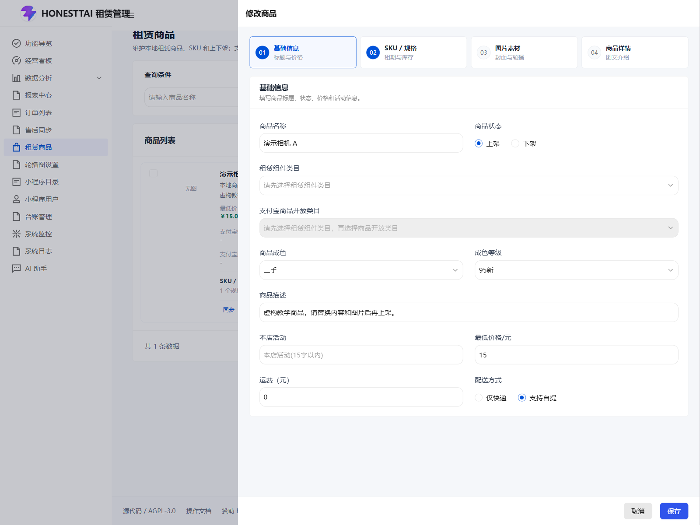
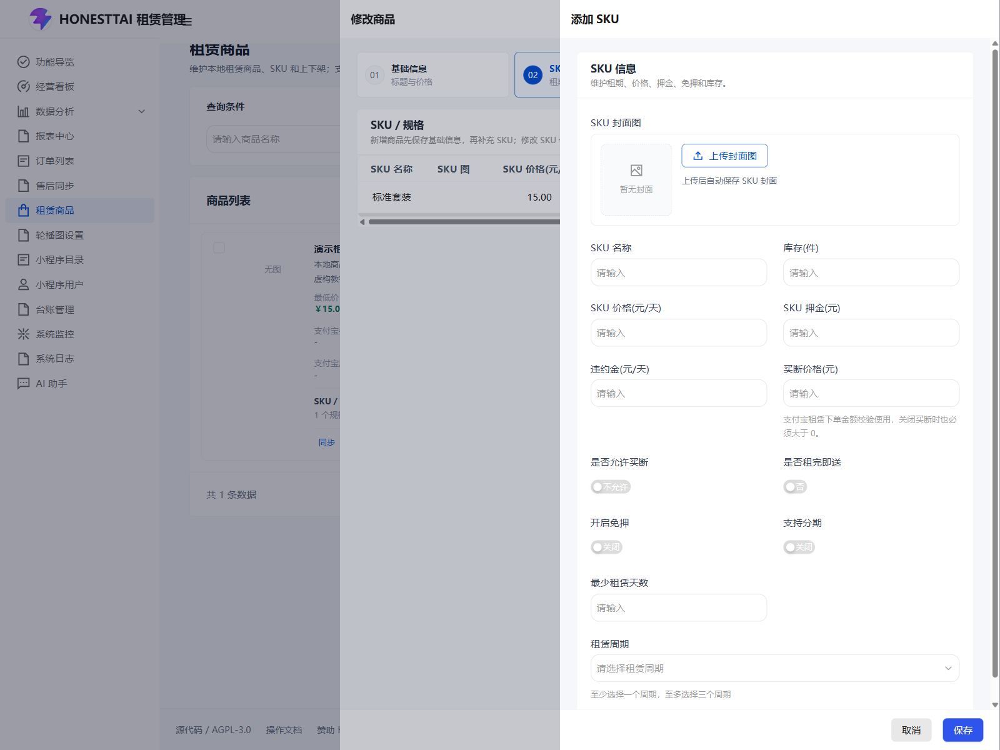
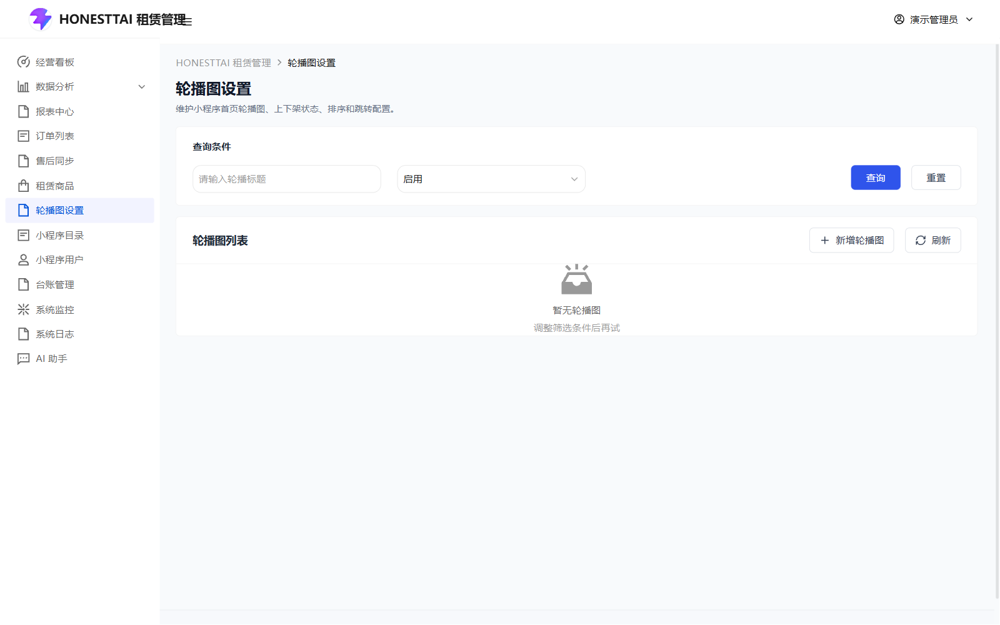
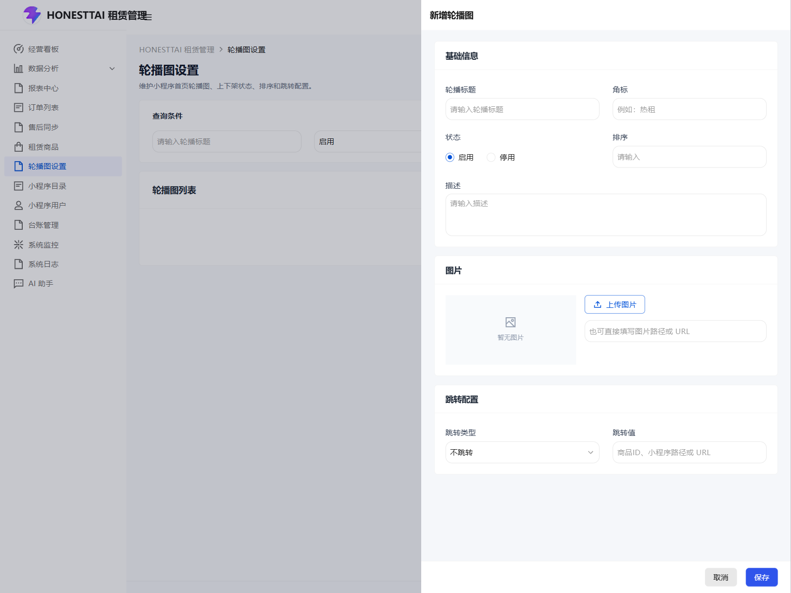
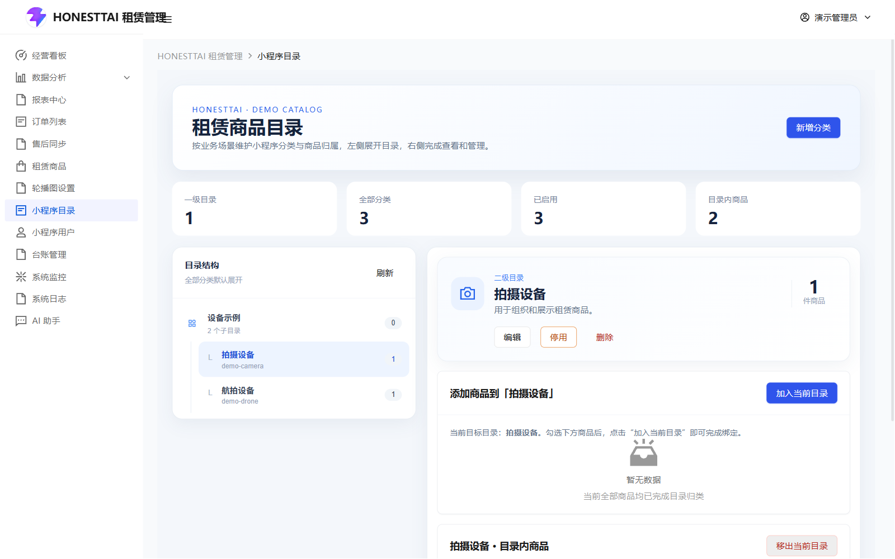
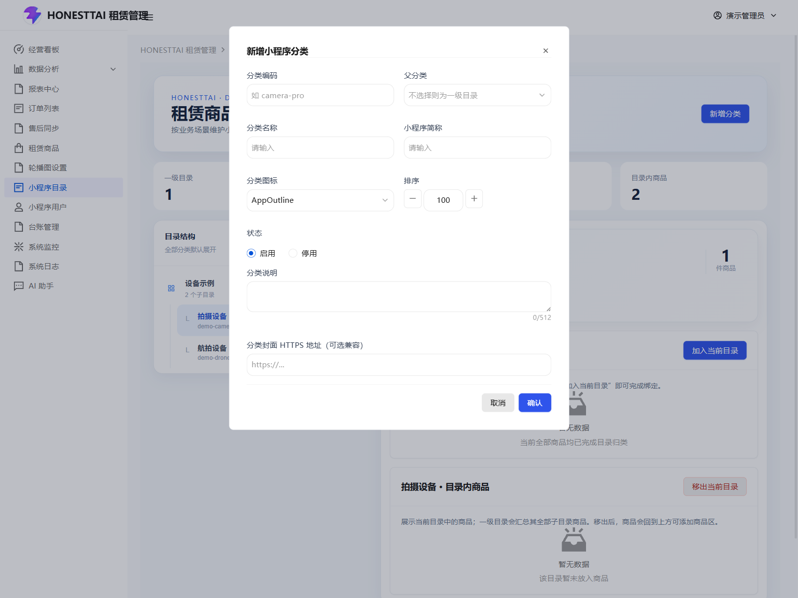

# 商品与小程序内容

[返回手册](../USER_GUIDE.md) · [外部接入条件](INTEGRATIONS.md)

## 1. 租赁商品

路由：`/alipay/goods`。

名称和商品状态可以筛选列表；“查询”读取结果，“重置”恢复查询条件，“刷新”重新读取当前列表。切换商品状态会清空名称及分类筛选。列表还使用自动查询，修改条件后结果可能已更新。

| 按钮/交互 | 具体行为与条件 |
| --- | --- |
| 添加商品 | 打开商品表单；需要商品新增权限。 |
| 批量删除 | 先勾选商品左侧复选框，再点击；无选择会提示。在“操作确认”中确认后删除所选商品，取消则不删除。 |
| 商品封面 | 点击图片放大预览，关闭查看器返回列表。 |
| SKU 展开/收起 | 查看或隐藏当前商品的规格摘要。 |
| 上架 | 对本地下架商品显示，需要修改权限；在“操作确认”中确认后请求上架。 |
| 同步 | 对本地已上架商品显示，需要商品同步权限；在“操作确认”中确认后提交支付宝同步任务，结果到日志核对。 |
| 日志 | 对本地已上架商品显示，打开分页同步记录；记录中的“详情”查看状态、模式、任务 ID、支付宝商品 ID、开始/完成时间、日志内容。 |
| 修改 | 当前界面对本地已上架商品显示；打开已有商品资料。 |
| 下架 | 对本地已上架商品显示，在“操作确认”中确认后提交本地下架。 |
| 置顶 | 在“操作确认”中确认后调整商品排序，完成后重新读取列表。 |
| 显示设置 | 设置卡片字段与操作按钮的显示及顺序；详见手册通用交互。 |

本地状态与支付宝审核、发布状态是不同字段。操作完成提示不代表支付宝已审核通过；检查支付宝原因和同步日志。小程序归类在“小程序目录”维护。

### 商品编辑

截图展示虚构商品的“修改商品”表单。为展示只在本地上架状态可见的编辑入口，本次隔离演示临时调整了该商品的本地状态，采集后恢复下架；公开初始化数据仍默认下架。打开表单没有提交商品保存或支付宝同步。新增商品表单默认选中本地上架，保存前请按实际需要调整。

按表单分段切换“基础信息”“SKU / 规格”“图片素材”“商品详情”。“保存基础信息”与底部“保存”均先校验当前商品信息，再弹出“操作确认”；最后点击“确认”提交，点击“取消”不提交。外层表单的“取消/关闭”离开编辑。新商品先保存基础信息取得商品 ID，再维护 SKU。

| 字段 | 内容与校验 |
| --- | --- |
| 商品名称、商品描述 | 均不能为空。 |
| 商品状态 | 选择“上架 / 下架”作为本地状态，保存后生效。 |
| 租赁组件类目 | 先选择；其后才能选择支付宝商品开放类目。 |
| 支付宝商品开放类目 | 必须与当前租赁类目匹配。变更类目时按确认提示处理受影响的选择。 |
| 商品成色、成色等级 | 选择全新或二手；仅二手显示“成色等级”，二手保存时必须选择有效等级。 |
| 本店活动 | 简短营销说明，页面提示 15 字以内。 |
| 最低价格 | 单位元，只用于展示，不代替 SKU 日租价。 |
| 运费 | 单位元。 |
| 配送方式 | 选择“仅快递”或“支持自提”；按真实可提供的配送方式设置。 |
| 商品封面图、商品轮播图 | 点击“上传封面图”或“上传轮播图”选择图片；点击预览放大。轮播图删除图标仅从编辑列表移除，需保存商品才生效。 |
| 商品介绍 | 使用富文本编辑器维护详细说明，编辑器工具栏用于文本格式、段落、列表、链接及媒体操作；上传图片需要已配置存储。 |

类目加载会访问当前部署的支付宝接口；缺少应用参数、接口权限或候选时，先完成接入配置。错误提示不妨碍查看本地商品与 SKU，但保存基础信息仍需满足类目校验。切换租赁类目后，不兼容的商品开放类目会被清空，需要重新选择。

已同步支付宝的商品修改开放类目后保存，会先出现“确认修改支付宝商品开放类目”弹窗：“确认修改”继续并允许重新提报/审核，“取消”中止本次保存；继续后仍需完成统一“操作确认”。重新审核期间可能影响展示和下单。不要使用演示商品发布真实支付宝商品。

### 商品介绍工具栏

当前使用 wangEditor 的默认工具栏，图标悬停可查看名称。以下动作修改当前富文本草稿；最终仍需点商品“保存”。

| 工具/下拉菜单 | 作用 |
| --- | --- |
| 标题、引用 | 设置当前段落的标题级别或引用格式。 |
| 加粗、下划线、斜体 | 切换所选文字格式。 |
| 更多样式 | 删除线、行内代码、上标、下标、清除格式。 |
| 文字颜色、背景色 | 给所选内容选择颜色。 |
| 字号、字体、行高 | 调整文字与段落排版。 |
| 无序列表、有序列表、待办 | 创建项目列表、编号或可勾选待办段落。 |
| 对齐 | 左对齐、右对齐、居中、两端对齐。 |
| 缩进 | 增加或减少段落缩进。 |
| 表情 | 插入选定表情。 |
| 链接 | 输入链接文字和地址后插入；选中已有链接可使用编辑器浮动菜单修改、取消或打开链接。 |
| 图片 | 可填写图片地址插入，或选择本地图片上传；本项目为图片上传接入了存储服务。 |
| 视频 | 默认工具栏包含插入/上传视频；本项目只配置了自定义图片上传，没有配置视频上传服务，不能将“上传视频”视为已接通。 |
| 表格 | 选择行列插入表格，随后通过编辑器表格菜单维护内容。 |
| 代码块、分割线 | 插入代码内容或段落分隔。 |
| 撤销、重做 | 在当前编辑历史内回退或恢复修改。 |
| 全屏 | 切换编辑区域全屏显示，退出后继续商品表单。 |

图片地址、链接和视频的插入菜单会要求相应 URL；上传图片会发起存储请求，取消文件选择不上传。浮动工具栏由当前选中的文字、链接、图片或表格决定，不能用于修改商品价格、库存或订单状态。

### SKU 表单

“添加 SKU”打开空表单；已有规格“修改”带入当前值；“删除”在“操作确认”中确认后删除该规格并刷新。表单的“保存”先校验，再等待“操作确认”；确认后单独保存该 SKU。“取消”仅关闭尚未提交的 SKU 表单。已保存/删除 SKU 不会因随后取消外层商品表单而回滚。

| 字段/开关 | 填写规则 |
| --- | --- |
| SKU 封面图、SKU 名称 | 必填；点“上传封面图”选择图片。 |
| 库存（件） | 可出租数量。 |
| SKU 价格（元/天） | 必须大于 0；用于租赁金额计算。 |
| SKU 押金（元） | 必须大于 0；即使开启信用免押，也保留商品押金基准。 |
| 违约金（元/天） | 按业务规则设置。 |
| 买断价格（元） | 当前表单保存校验要求大于 0；未手动修改时随押金派生，最小 1 元。 |
| 是否允许买断、是否租完即送 | 控制对应租赁方案能力。 |
| 开启免押 | 先填写大于 0 的押金，否则开关自动关闭并提示。真实免押仍需芝麻信用能力和用户授权。 |
| 支持分期 | 开启后必须选择可选分期期数；该选项不等于已经启用自动代扣。 |
| 最少租赁天数、租赁周期 | 填写最低天数，周期至少选择一项；页面提示至多选择三个周期，应与实际方案一致。 |
| 可选分期期数 | 选择用户可用的期数，1 期表示不分期，选项最多支持 24 期。 |

金额输入为元，提交时转换为分；避免把分值再次填入元输入框。

## 2. 轮播图设置

路由：`/alipay/banners`。

按轮播标题、启用/停用状态筛选；“查询”“重置”“刷新”管理结果。“新增轮播图”打开右侧抽屉；每条记录的“编辑”“启用/停用”“置顶”“删除”分别维护资料、状态、排序和记录，受对应权限控制。点击图片可以放大预览。

| 字段 | 填写与结果 |
| --- | --- |
| 轮播标题 | 必填，描述这张轮播图的内容。 |
| 角标 | 可选短标签，例如活动标识。 |
| 状态 | 单选启用或停用；启用后是否展示还依赖小程序接口和客户端。 |
| 排序 | 控制轮播顺序；保存后查看列表顺序，也可使用行内置顶。 |
| 描述 | 填写图片的补充说明。 |
| 图片 | 必填。点击“上传图片”选择 PNG/JPG/JPEG/WebP，或填写自己的图片路径/URL；点击预览放大。 |
| 跳转类型 | 不跳转、商品详情、小程序路径、外部链接。 |
| 跳转值 | 对应填写商品 ID、小程序路径或外部 URL；不跳转时无需实际目标。 |

点击“保存”提交，“取消/关闭”退出。行内“启用/停用”“置顶”“删除”当前直接提交，没有第二次确认；删除的是轮播记录。这里只维护接口返回的数据，真实小程序需实现对应展示与跳转。

## 3. 小程序目录

路由：`/alipay/catalog`。

| 控件 | 操作方法 |
| --- | --- |
| 左侧一级/二级目录 | 点击选择目录，右侧显示资料和商品。一级目录汇总子目录。 |
| 刷新 | 重新加载目录结构。 |
| 新增分类 | 打开分类表单；选择父分类为二级目录，父分类留空为一级目录。 |
| 编辑 | 修改所选分类资料，分类编码只读；状态通过独立启停操作维护。 |
| 停用/启用 | 弹窗显示受影响商品数量；有启用子分类时提示先停用子分类。确认后改变目录公开状态。 |
| 删除 | 明确确认弹窗；只有没有子分类且没有绑定商品的分类可以删除。 |
| 加入当前目录 | 先选择启用的具体目录，再勾选上方未归类商品。未选目录、目录停用、有子目录或未选商品时不能提交。 |
| 清空选择 | 清除对应商品列表的勾选，不改变绑定。 |
| 移出当前目录 | 勾选目录内商品后批量解绑。 |
| 移出类目 | 解绑该行商品，商品返回可添加区；不会删除商品本身。 |
| 商品分页 | 分别翻页查看未归类商品和当前目录商品，不影响另一块列表。 |

| 字段 | 填写与结果 |
| --- | --- |
| 分类编码 | 必填，作为目录标识；编辑已有分类时只读。 |
| 父分类 | 留空为一级目录，选择已有父分类建立二级目录。 |
| 分类名称 | 必填，后台识别名称。 |
| 小程序简称 | 必填，供小程序展示的短名称。 |
| 分类图标 | 必填，下拉可搜索 antd-mini 图标并预览。 |
| 排序 | 数字不小于 0，控制目录顺序。 |
| 状态 | 仅新增表单提供；已有分类使用独立启用/停用入口。 |
| 分类说明 | 最多 512 字。 |
| 分类封面 HTTPS 地址（可选兼容） | 可选，填写自己的 HTTPS 图片地址。 |

点击“确认”保存，点击“取消/关闭”放弃。

停用目录会隐藏其下符合公开条件的商品展示；本地商品上下架、目录启用以及支付宝远端状态应分别核对。

## 源码依据

[商品页面](../../equipment_management_system_fornt/apps/rent-tdesign/src/pages/alipay/goods/index.vue) · [轮播页面](../../equipment_management_system_fornt/apps/rent-tdesign/src/pages/alipay/banners/index.vue) · [目录页面](../../equipment_management_system_fornt/apps/rent-tdesign/src/pages/alipay/catalog/index.vue)。
