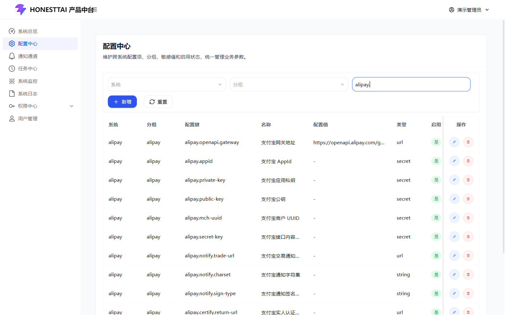
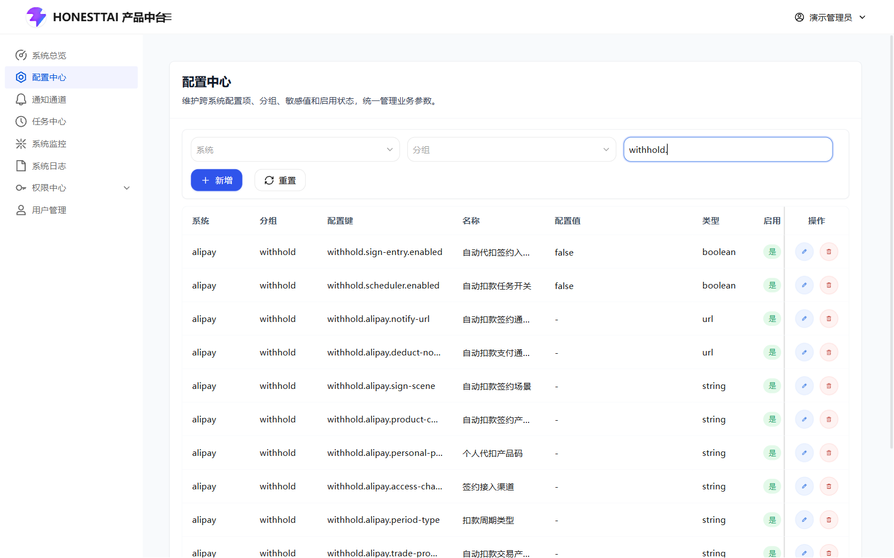

# 支付宝、e签宝与自动代扣接入

[返回操作手册](../USER_GUIDE.md) · [配置中心操作](PLATFORM.md) · [订单按钮与状态](ORDERS.md) · [官方资料](../REFERENCES.md)

本项目开源支付宝租赁业务后端、中台和运营后台，包含商品接入、交易履约、售后、电子合同、分期账单及自动代扣相关代码。实际业务还需要部署方的应用、接口权限、密钥、回调地址和用户授权。本仓库不附带可发布的小程序前端或第三方商户资质。

以下三张图展示本地配置页面，敏感值为空或演示状态；它们不代表完成真实平台接入。实际支付、扣款、代扣签约、退款、合同签署、商品发布与售后提交不用于文档演示。

## 1. 先理解配置中心

进入中台“配置中心”，系统选择 `alipay`，按分组或关键词定位参数。编辑图标打开表单，确认系统、配置键、类型、敏感与启用标记后保存。新增配置键必须有代码读取才能生效；随意起一个同名业务名称不会产生功能。

演示学习保留支付宝/e签宝凭证为空，并显式保持 `withhold.sign-entry.enabled=false`、`withhold.scheduler.enabled=false`、`esign.enabled=false`。运行配置应使用初始化脚本生成的文件；不要将所有历史 SQL 修复脚本顺序执行当作初始化。

## 2. 支付宝应用、商品与交易

筛选方式：系统 `alipay`，分组 `alipay`；关键词可用 `alipay.`。与交易相关的其他分组还包括商品、支付、账单和租赁配置。

| 配置范围 | 内容与核对方式 |
| --- | --- |
| 应用身份与签名 | `alipay.appid`、应用私钥、支付宝公钥/对应验签配置、网关等。值来自自己的支付宝开放平台应用，不能从演示记录复制。 |
| 应用与商户能力 | 按实际业务申请所需商品、租赁、免押、支付与售后接口权限；能登录开放平台不代表全部接口获准。 |
| 商品类目与字段 | 配置租赁组件类目、开放平台商品类目和成色等；商品编辑中的候选由对应接口和配置决定。 |
| 回调地址 | 使用部署后外部可达的 HTTPS 地址，确认网关路由、签名校验和订单映射。商品、支付、账单等回调是不同用途。 |
| 存储与资源 | 图片和协议 PDF 需存到部署方自己的存储服务，地址应按业务需要被用户/第三方服务访问。 |
| 合同主体和归还地址 | 填写真实部署主体、联系方式、合同条款和 `rent.return.address.json`；不能把本地演示数据作为经营主体。 |
| 小程序身份与 JWT | 后台员工使用中台登录；小程序用户使用对应接口和 `miniapp.jwt.*` 配置。初始化生成独立签名密钥。 |

操作顺序：建立自己的应用并开通所需能力 → 填配置与回调 → 核对商品/SKU与类目 → 在合适的测试环境逐项联调 → 对照商品同步日志、订单详情、台账与回调确认结果。

运营后台维护商品并同步后，仍需核对支付宝返回的审核、冻结、上架等状态。“本地已上架”不代表支付宝已通过；后台列表中的示例远端 ID 也不是真实可交易商品。

官方入口：[支付宝开放平台](https://open.alipay.com/)、[支付宝文档中心](https://opendocs.alipay.com/mini)。本章按钮行为以仓库实现为依据，具体产品准入和调用参数以相应官方 API 文档为准。

## 3. e签宝电子合同

筛选方式：系统 `alipay`，分组 `esign` 或关键词 `esign.`。

| 参数/范围 | 操作说明 |
| --- | --- |
| `esign.enabled` | 全局电子合同能力开关；按订单风险/合同要求决定具体流程。演示环境关闭。 |
| `esign.base-url` | 接入服务的基础地址，不能留成其他部署方地址。 |
| `esign.auth-mode` | 当前适配器支持官方 OAuth2 方式与兼容签署网关方式；选择自己的实际接入模式。 |
| `esign.app-id`、`esign.app-secret` | 官方 OAuth2 方式的应用凭证；配置为敏感值。当前填写 AppSecret 也会使适配器选择 OAuth2 路径。 |
| `esign.auth-token` | 兼容签署网关方式使用的授权令牌。 |
| `esign.upload-path`、`esign.sign-flow-path`、查询/下载路径 | 兼容网关方式需配置对应接口路径；查询/下载路径中的流程占位符需与网关约定一致。 |
| `esign.notify-url` | 签署状态回调入口，核对外网连通、服务处理及流程标识关联。 |
| `esign.auto-archive`、签署顺序和签名位置 | 按实际流程配置归档、个人签署方式与位置。固定位置需核对 PDF 页码与坐标。 |
| `esign.platform-sign.enabled`、`esign.seal-id` | 企业盖章开关与印章选择；开启前配置有权限的企业印章及签署顺序。 |
| `esign.miniapp.*` | 自行开发的小程序跳转签署所需 AppId、环境、路径和参数；与当前 e签宝小程序接入方式匹配。 |

签署前应有正确的协议 PDF、签署人姓名、手机号和身份证资料；当前适配器会拒绝缺失的签署人信息。后台“发起 / 继续签署”只是请求建立或恢复流程，实际签署由对应用户完成。

运营核对路径：订单详情 → 协议 → 发起/继续签署 → 用户在正式签署入口完成 → 查询/回调更新 → 查看签署文件 → 按订单条件回传支付宝。原协议 PDF、电子签署完成与支付宝回传成功是三个独立检查点。

要求电子合同的订单在确认收货时会检查签署完成状态。不要为通过演示而手工把合同改成已完成。官方入口：[e签宝文档中心](https://open.esign.cn/doc/opendoc)。

## 4. 分期账单与自动代扣

筛选方式：系统 `alipay`，分组 `withhold` 或关键词 `withhold.`。

项目包含分期账单、支付宝协议签约、签约回调、扣款适配器与到期任务。商品 SKU 的“支持分期”用于分期计划设置，**它不等于用户已经授权自动扣款**。

| 参数/条件 | 含义 |
| --- | --- |
| `withhold.sign-entry.enabled` | 服务端是否允许发起新的代扣签约。演示环境为 `false`。 |
| `withhold.scheduler.enabled` | 是否执行到期自动扣款任务。演示环境显式设为 `false`；不能只关闭前端入口来控制任务。 |
| `withhold.alipay.notify-url` | 协议签约回调地址，发起签约时必需。 |
| `withhold.alipay.deduct-notify-url` | 扣款支付回调地址；当前实现为空时回退 `billing.alipay.notify-url`。 |
| 场景、产品码、个人产品码、接入渠道 | `withhold.alipay.sign-scene`、`product-code`、`personal-product-code`、`access-channel` 等，必须与部署方获准的实际产品匹配。初始化中的通用字符串不能保证业务准入。 |
| `withhold.scheduler.start-hour` / `end-hour` | 按北京时间限制任务发起时段；当前实现默认 7 点至 22 点之前。 |
| 订单状态 | 新签约要求审核通过、已支付、商家发货、用户收货、用户寄回或商家签收等有效状态。 |
| 待收账单 | 订单必须有待支付、逾期或支付中的分期账单；没有待收账单时拒绝新签约。 |
| 用户归属与授权 | 小程序签约要求订单属于当前登录用户，并由本人完成支付宝协议授权。 |

当前运营后台“发起代扣签约”按钮被前端常量关闭；只展示已有签约状态及分期账单，并提供“刷新账单”。服务端开关和前端可见入口是两个条件，仅修改中台开关不会自动显示该后台按钮。小程序端对接需要自行实现用户签约交互。

调度器当前每 10 分钟扫描到期、待付或逾期账单；仅对存在已签约协议的订单尝试扣款，并使用锁避免同时处理同账单。扣款可能改变真实资金状态，因此需要先完成应用权限、用户授权、回调与结果核对，再由部署方启用。

正确核对顺序：有效分期订单 → 用户完成代扣协议授权 → 协议状态与回调一致 → 账单到期 → 合法扣款任务执行 → 核对交易号、实付金额、账单状态与台账。签约中、任务执行中、支付结果和全部分期结清应分别确认。

## 5. 常见接入问题

| 现象 | 优先检查 |
| --- | --- |
| 配置已填但仍报缺失 | 系统是否 `alipay`、键名是否一致、配置是否启用、值是否为空、中台可达与缓存刷新。 |
| e签宝报签署人缺失 | 订单关联用户的姓名、手机、证件资料及生成 PDF 中的签署人信息。 |
| 已签署但后台未完成 | 流程 ID、签署查询结果、回调到达与处理、文件是否可下载。 |
| 代扣按钮看不到 | 当前版本后台主动入口关闭；查看已有账单和状态，不以修改 DOM 方式绕过。 |
| 已有协议但未扣款 | 调度开关、北京时间窗口、账单到期/状态、已签约协议、交易错误与日志。 |
| 扣款失败或状态不一致 | 先核对支付交易号和回调，避免把失败重试当作全新付款。 |

实现依据：[e签宝适配器](../../equipment-alipay/src/main/java/com/fly/rent/capability/contract/EsignContractAdapter.java)、[代扣签约服务](../../equipment-alipay/src/main/java/com/fly/rent/capability/withhold/WithholdAgreementService.java)、[代扣任务](../../equipment-alipay/src/main/java/com/fly/rent/capability/withhold/WithholdDeductScheduler.java)。
