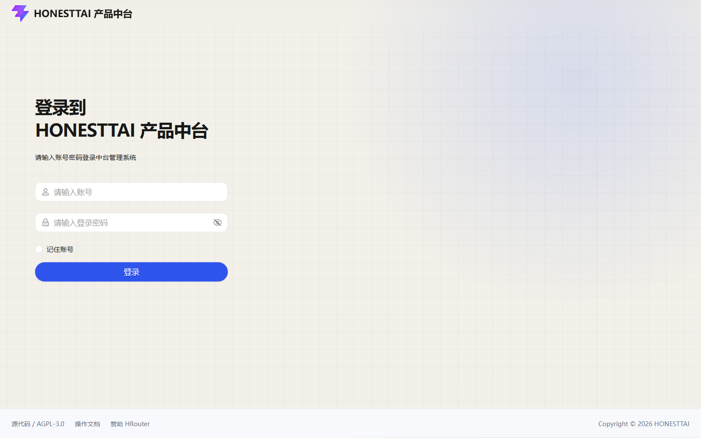
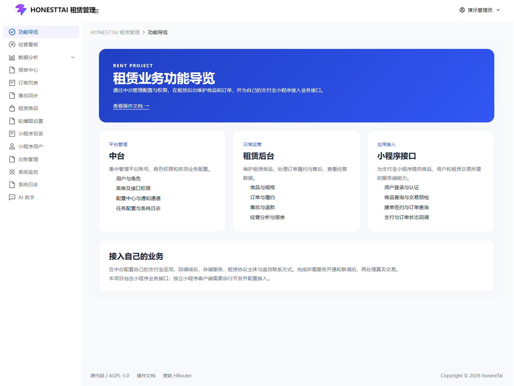
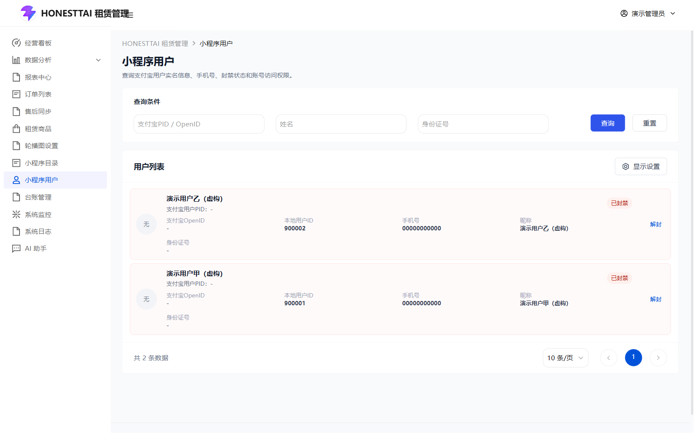
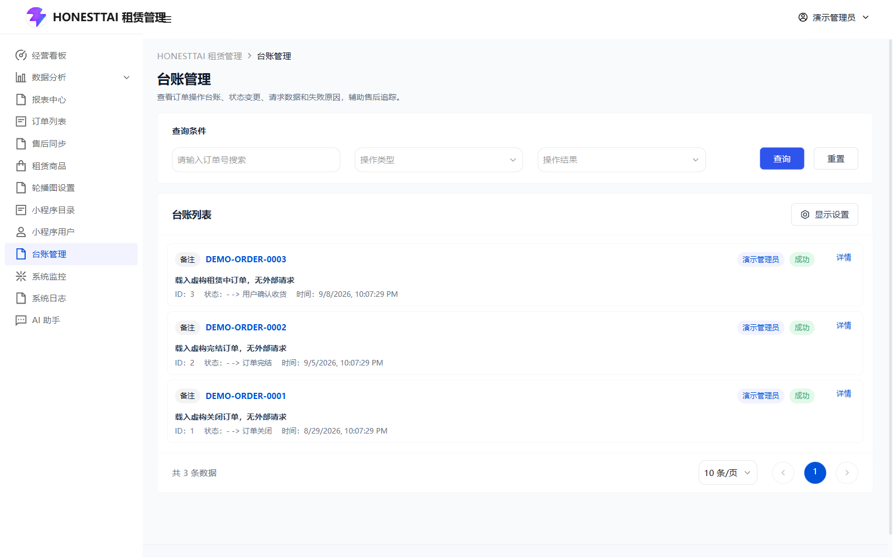
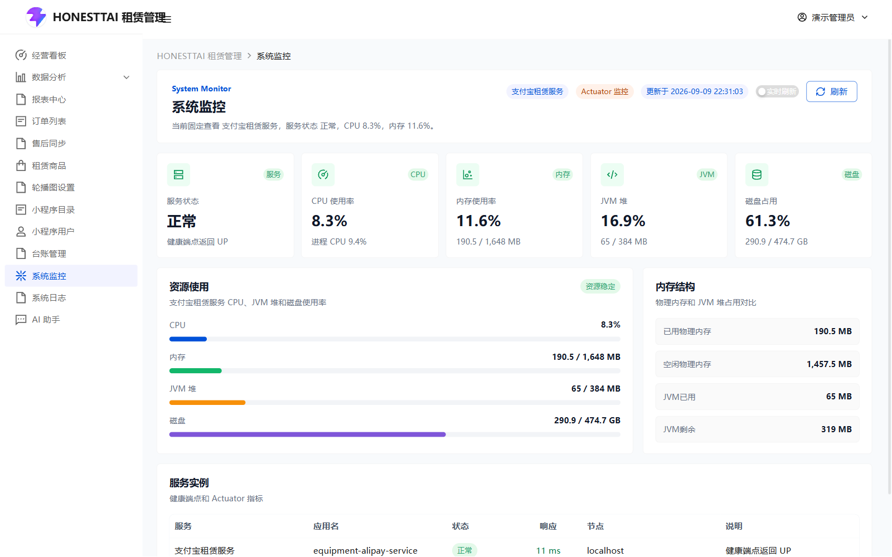
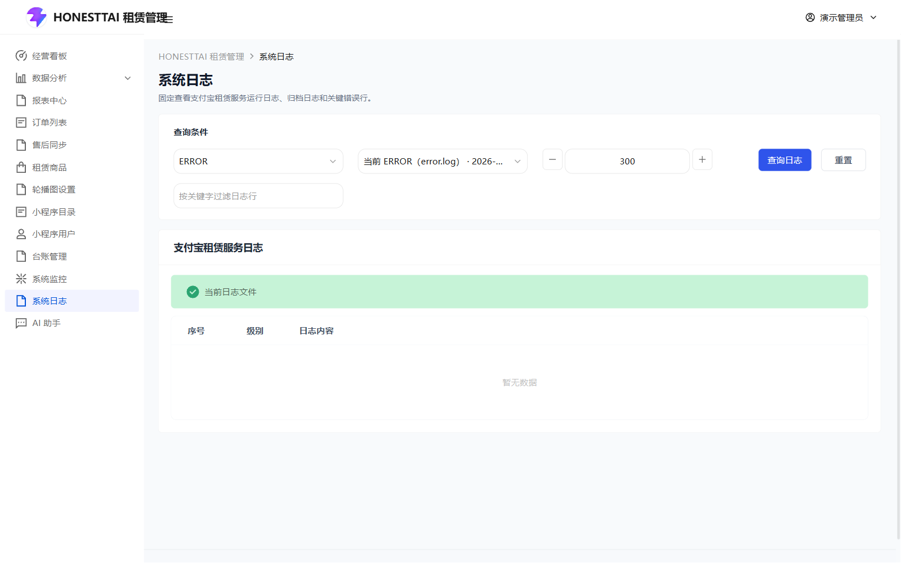
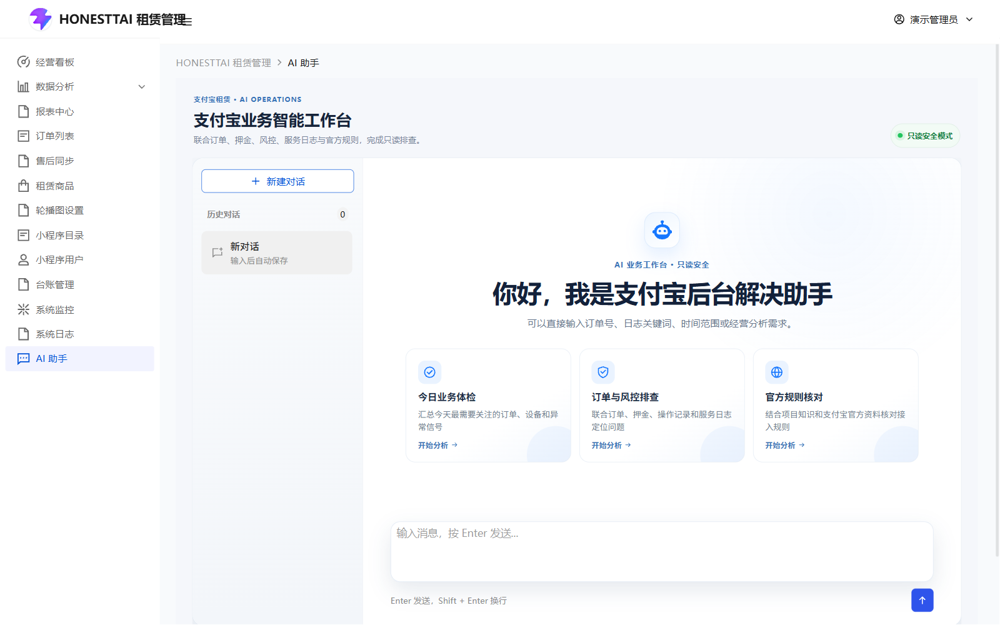
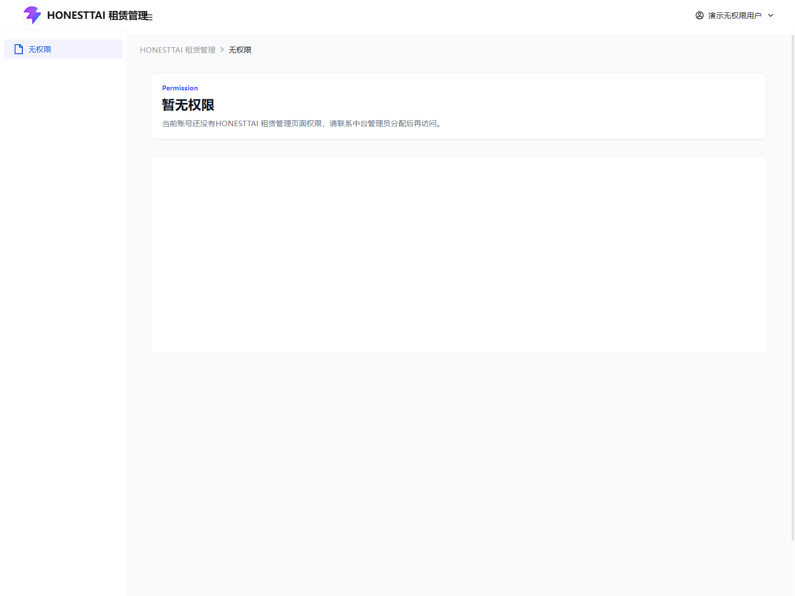

# 运营支持：入口、用户、台账、监控与 AI

[返回操作手册](../USER_GUIDE.md) · [中台管理](PLATFORM.md) · [订单与售后](ORDERS.md)

## 1. 租赁登录 `/login`

租赁后台的登录路由是统一登录跳转页：进入后显示加载并跳转中台登录入口，不存在第二套独立的租赁账号密码表单。截图展示从租赁入口到达的统一登录页面。

输入中台后台账号和密码后登录，按 SSO 跳转返回业务系统。账号密码字段、密码显示/隐藏、清空和登录按钮的操作见 [中台登录](PLATFORM.md)。若循环跳转，检查中台与租赁前端入口、网关地址、SSO 配置及浏览器登录态。

## 2. 功能导览 `/alipay/delivery-showcase`

页面介绍中台、租赁后台、小程序接口三个模块，以及部署方需要填写自己的应用、回调域名、存储和协议主体。唯一业务内容链接“查看操作文档”在新窗口打开本项目文档站。

该页不展示真实商家上线案例、二维码或经营业绩，也没有申请接入或编辑模块的表单。仓库提供支付宝小程序服务端接口，独立的小程序前端需要自行开发。

## 3. 小程序用户 `/alipay/users`

这里管理通过小程序登录的用户，和中台员工账号、角色授权不同。

| 控件/按钮 | 使用方法 |
| --- | --- |
| 支付宝 PID / OpenID | 填写用户对应标识，避免将本地用户 ID 填入此筛选项。 |
| 姓名 | 按实名姓名查询；清空后不按姓名限制。 |
| 身份证号 | 按对应身份信息查询。 |
| 查询 / 重置 | 按当前条件加载；重置清除条件并重新加载。 |
| 显示设置 | 控制卡片的辅助字段及封禁/解封按钮；可调整字段顺序、恢复默认并保存。 |
| 字段提示 | 鼠标移到被截断的有效字段上查看完整值。 |
| 封禁 | 正常访问用户显示，需要用户更新权限；点击后在“操作确认”中确认才请求封禁，取消不改变访问状态。 |
| 解封 | 已封禁用户显示，需要相同权限；在“操作确认”中确认后请求恢复访问。 |
| 分页 | 按当前条件翻页、调整每页条数。 |

用户卡片显示头像、昵称及已选择的 PID/OpenID、本地用户 ID、手机、实名、身份证和访问状态等字段。缺少头像时使用占位图标。本页没有新建小程序用户、修改实名信息、重置中台密码或分配后台角色的按钮。

## 4. 台账管理 `/alipay/ledger`

| 控件/按钮 | 使用方法 |
| --- | --- |
| 订单号 | 全局页面按单号查操作记录；从订单上下文进入时固定订单，可能隐藏这个输入项。 |
| 操作类型 | 可搜索并选择创建订单、支付、发货、确认收货、归还、退款、关闭订单、完结订单、商户审核、扣减押金、租金支付、押金冻结、取消、同步或备注，可清空。 |
| 操作结果 | 选择成功或失败，按后端记录查看；清空则不按结果限制。 |
| 查询 / 重置 | 按条件重新读取；当前订单上下文的固定约束不会变成其他订单。 |
| 订单号链接 | 全局列表可跳到对应订单；当前固定订单上下文下不重复提供相同跳转。 |
| 详情 | 打开单条日志详情，查看请求、响应和错误信息。 |
| 显示设置 | 控制台账列或可见操作。 |
| 分页 | 查看当前查询下的其他记录。 |
| 详情右上角关闭 | 返回列表。详情只读，没有保存、重放请求或重试按钮。 |

先按订单号定位，再结合发生时间、操作类型和结果核对；请求被接收和远端业务进入终态是两件事。原始请求/响应可能包含敏感信息，公开反馈问题时只保留必要错误摘要。

## 5. 租赁监控 `/alipay/monitor`

本页固定查看租赁服务。使用“实时刷新”开关控制周期刷新，点击“刷新”立即重新查询。数据包括主机资源、CPU/内存、服务实例、健康与运行信息等，随后端实际可提供项展示。

本页没有中台监控中的服务下拉选择，也没有启动、停止或重启服务按钮。连续异常时转到系统日志，部署层操作见 [部署说明](../DEPLOYMENT.md)。空指标可能意味着监控数据未返回，而不是资源占用为零。

## 6. 租赁系统日志 `/alipay/system-logs`

| 控件/按钮 | 使用方法 |
| --- | --- |
| 日志级别 | 选择需要查看的级别，可清空；按页面加载可用日志。 |
| 日志文件 | 从服务返回的文件列表选择来源，支持下拉筛选。 |
| 读取行数 | 50 至 1000，按 50 的步长调整读取尾部行数。 |
| 关键词 | 在日志检索中填写定位关键字；建议使用错误码或订单标识，避免输入密钥。 |
| 查询日志 | 按当前文件、级别、行数和关键词读取日志。 |
| 重置 | 恢复筛选条件并重新读取。 |
| 日志内容区域 | 滚动查看文本；当前没有在线编辑或清空日志操作。 |

文件不存在或没有内容时，检查服务是否输出文件日志、配置的来源目录和日志挂载路径。不要将前端查询无结果当作服务没有发生错误。

## 7. AI 助手 `/alipay/agent`

AI 助手需要独立启动 `equipment-agent`，网关可达，模型服务已在中台配置。未配置模型或所需工具时，界面可以显示，但问题可能返回连接错误或证据不足。部署与只读数据接入见 [Agent 说明](../../equipment-agent/README.md)。

| 控件/按钮 | 使用方法 |
| --- | --- |
| 新建对话 | 清空当前展示、开始新对话；不会删除历史。 |
| 历史对话 | 点击标题读取该会话消息；列表显示更新时间。 |
| 删除历史图标 | 仅在接入 API 提供删除能力时显示；在“操作确认”中确认后删除对应历史，取消不删除。当前会话被删除后转到新对话。 |
| 推荐问题 | 点击将文字填入输入框，可以修改；不会自动发送。 |
| 追问选项 | 助手需要补充条件时点击选项，内容填入输入框，再发送。 |
| 输入框 | 写清问题、时间与对象。Enter 发送，Shift + Enter 换行。 |
| 发送消息 | 圆形发送按钮提交输入；空白或正在运行时不能再次发送。 |
| 停止生成 | 运行中出现停止按钮，中止本次生成；已返回的消息仍可核对。 |
| 分析过程 | 点击运行过程标题展开/收起事件，查看工具成功、失败、跳过及耗时。 |
| 查询证据 | 展开/收起工具证据，核对工具名称、结果概要和只读标记。 |
| 联网来源 / 查看原文 | 若回答提供有效 HTTPS 来源，点击卡片在新窗口打开原文；当前最多展示 5 条。 |
| 结果指标与图表 | 查看回答对应的数值、单位与范围；图表是查询展示，不是执行指令。 |
| 后续建议 | 点击建议填入输入框，确认文本后再次发送。 |

侧边悬浮版本另外有“打开 AI 助手”和“关闭 AI 助手”按钮；独立 AI 页面不显示关闭整个页面的按钮。

适合的问题例如：“按本月的已记录订单比较设备收入，说明统计口径”“检查最近 7 天商品同步失败的原因”。业务工具以只读查询为设计目标，回答中的发货、退款或扣款建议不会因此被执行。动态 SQL 能力需要专用只读数据库账号；公开搜索不应携带客户身份资料、密钥或完整内部日志。

## 8. 无权限提示 `/alipay/no-permission`

当前页面只展示无权限说明，没有页面内“返回中台”“重新登录”按钮。可通过浏览器返回或系统现有账号导航离开；由管理员到中台核对启用角色、页面和 API 授权，保存后重新登录。

直接输入路由、修改显示设置或反复刷新都不会增加授权。菜单和操作缺失也可能是订单状态门槛，先区分没有页面权限与某行不满足动作条件。

源码入口：[租赁路由](../../equipment_management_system_fornt/apps/rent-tdesign/src/router/modules/alipay.ts)、[小程序用户](../../equipment_management_system_fornt/apps/rent-tdesign/src/pages/alipay/users/index.vue)、[台账](../../equipment_management_system_fornt/apps/rent-tdesign/src/pages/alipay/logs/index.vue)、[AI 共用组件](../../equipment_management_system_fornt/shared/components/AgentChatPanel.vue)。
