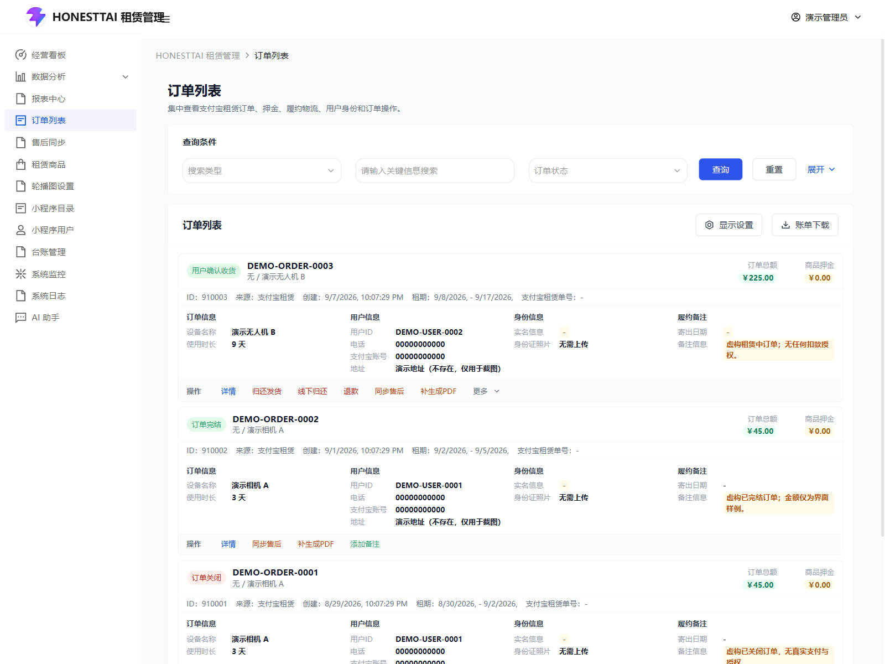
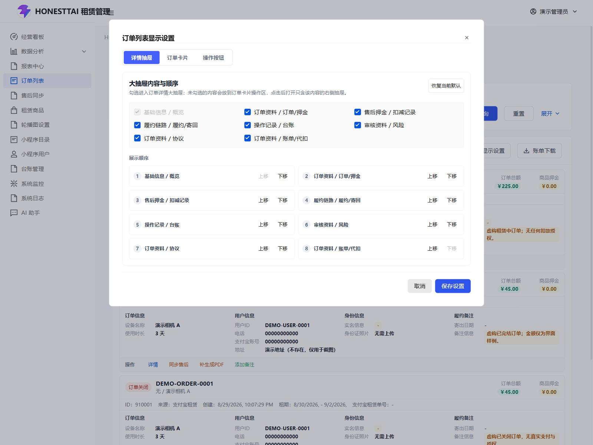
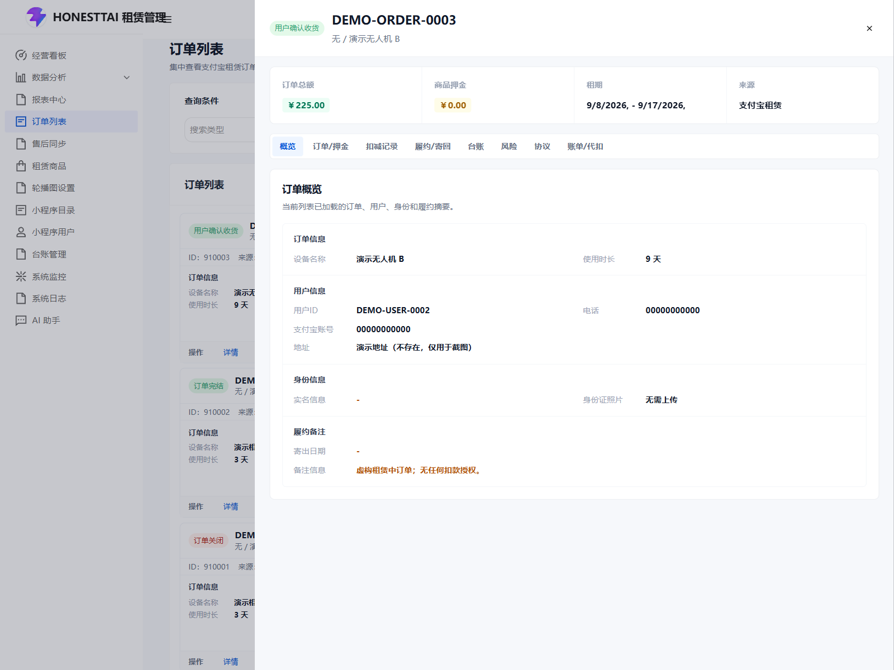
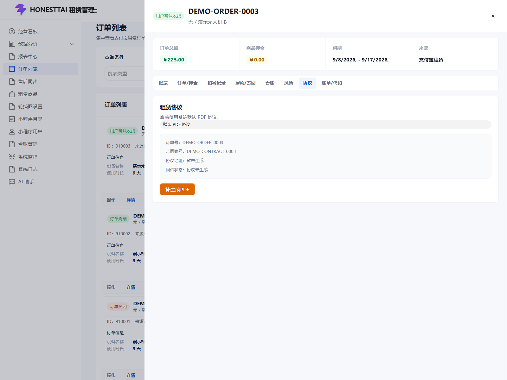
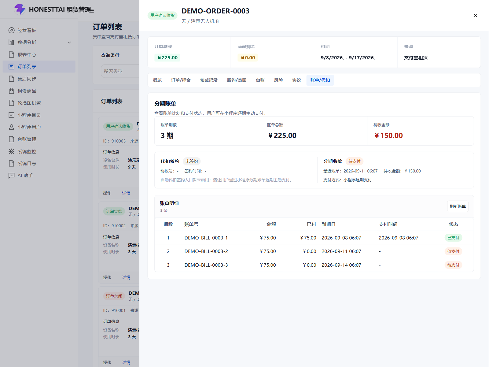
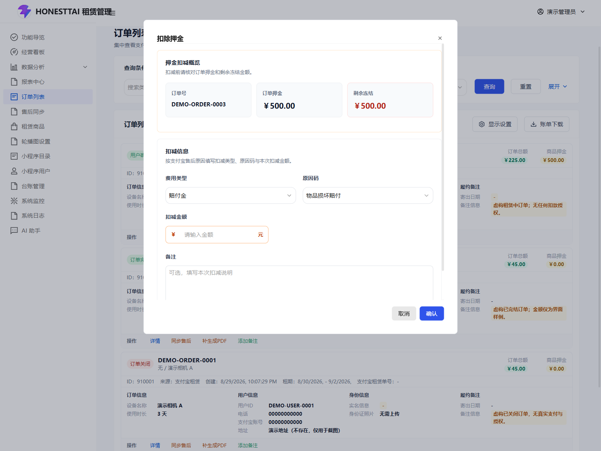
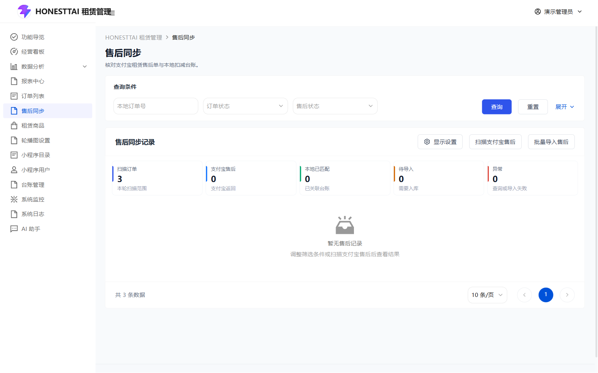

# 订单、押金与售后

[返回操作手册](../USER_GUIDE.md) · [商品管理](CATALOG.md) · [支付宝、e签宝与代扣](INTEGRATIONS.md)

本章按当前 `orders/index.vue`、`aftersale/index.vue` 和租赁后端接口编写。按钮同时受权限、订单来源、状态和显示设置约束。演示截图只展示本地虚构记录；截图中金额、状态不代表真实支付宝冻结、支付、退款或电子签署成功。

## 1. 订单列表 `/alipay/orders`

### 查询、列表与显示设置

| 控件 | 操作与结果 |
| --- | --- |
| 搜索类型 | 选择商品名称、收货人、手机号码、订单号或身份证信息，右侧输入对应关键词。输入订单号时不要仍选商品名称。 |
| 订单状态 | 选择需要处理的状态；清空后不按该状态限制。 |
| 展开 / 收起 | 展开附加时间条件和账单日期；收起仅折叠界面。 |
| 时间选择 | 全部、近 7 天、近 15 天、近 30 天；也可使用开始/结束日期范围。 |
| 查询 | 使用当前条件重新取数。分页后更换条件，从新结果核对订单。 |
| 重置 | 清除当前查询条件并重新加载列表。 |
| 账单日期 | 供账单入口读取的日期，不能当作订单支付状态。 |
| 账单下载 | **当前实现仅显示“账单下载暂未开放”的提示，没有生成或下载文件。** |
| 显示设置 | 控制订单卡片字段、列表操作及详情模块的显示和顺序。保存后只改变界面偏好。 |
| 详情 | 打开该订单详情抽屉；随后按模块加载相应记录。 |
| 更多 | 当可见操作超过首批按钮时展开其余操作，不代表这些操作被禁用。 |
| 分页 | 切换页码和每页条数；以当前查询结果总数为准。 |

当前管理页面没有手工新建真实支付宝订单的表单，订单来自接入的小程序交易接口。若某行缺少有效来源记录，即便显示了订单信息，也可能不提供业务操作。

### 状态对应的按钮

下表列出页面可见条件；实际提交仍由后端、支付宝和订单数据校验。关闭、退款及退款审核、商家风控审核、收货、归还、完结、备注、订单同步和押金扣减，在请求发出前会弹出统一的“操作确认”，选择“确认”才发送请求，选择“取消”中止。商家发货与自提发货使用专用风险确认，完成后不重复弹通用确认框。身份照片审核等未列入统一确认的入口按下表说明操作；每次先核对当前行的订单号。

| 按钮 | 主要显示条件 | 点击后的处理 |
| --- | --- | --- |
| 订单关闭 | 用户下单 `CREATED`、用户已签约 `SIGNED`、审核通过 `APPROVED`、商家发货 `DELIVERED` | 在操作确认框确认后关闭，随后核对订单及台账。 |
| 商品发货 | 已支付 `PAID`，配送方式不是自提 | 打开发货信息表单，完成风险确认后提交。 |
| 自提发货 | 已支付，订单本身选择自提 | 进入发货风险确认，按自提方式提交履约信息。 |
| 确认收货 | 商家发货 `DELIVERED` | 先检查电子合同门槛；符合后经操作确认提交收货。 |
| 归还发货 | 用户确认收货 `RECEIVED` | 打开寄回物流表单，填写后经操作确认提交。 |
| 线下归还 | 用户确认收货 | 经操作确认提交线下归还记录，不能用来证明已实际收到设备。 |
| 确认归还收货 | 用户寄回 `RETURN_DELIVERED` | 经操作确认提交商家签收请求。 |
| 订单完结 | 商家签收 `RETURN_RECEIVED` | 先选择完结类型，再经操作确认提交。 |
| 扣除押金 | 剩余押金大于 0，且不是已完结或已关闭 | 先打开扣减表单；提交表单后再经操作确认创建赔付售后，后续付款见扣减记录。 |
| 退款 | 已支付、审核通过、商家发货、用户确认收货、用户寄回、商家签收 | 经操作确认请求退款；以真实交易和最终状态为准。 |
| 同意退款 / 不同意退款 | 退款中 `PENDING_CANCEL` | 经操作确认提交对应处理结果。 |
| 同步售后 | 有有效订单来源 | 进入带当前订单条件的售后页面。 |
| 补生成 PDF / 重新生成 PDF | 已签约及之后适用状态，含已完结、已关闭 | 调用协议生成服务；已有文件时显示重新生成。 |
| 回传协议 | 有 PDF；用户确认收货、用户寄回、商家签收或已完结；尚未成功回传文件 | 调用支付宝协议回传接口。 |
| 身份通过 / 身份驳回 | 已签约、要求身份照片、待审核且正反面照片齐全 | 直接提交审核；驳回使用页面预设的补充清晰正反面照片说明。 |
| 添加备注 | 有有效订单来源 | 打开备注文本框，填写后经操作确认保存。 |

订单状态描述用于识别页面，不是保证所有订单依次经过的流程。支付、物流、退款、合同和代扣分别有自己的结果与回调。

## 2. 订单详情抽屉

点击顶部或侧边分段导航切换模块；模块首次展开时会单独加载，短暂空白或加载提示不表示记录丢失。抽屉右上角关闭按钮返回列表。

| 模块 | 可查看内容与交互 |
| --- | --- |
| 概览 | 订单号、商品/SKU、用户、金额、状态和关键时间；该模块锁定保留。 |
| 订单 / 押金 | 远端订单、押金预授权与支付情况，包含授权号、交易号、冻结与剩余额度等。远端查询失败时先处理错误，不能把空值当作零余额。 |
| 扣减记录 | 本地赔付售后与扣款记录、来源、金额、远端状态、错误说明；独立分页及可用后续操作。 |
| 履约 / 寄回 | 收件人、地址、配送及寄回信息。身份图片可点击预览；业务操作仍按状态限制。 |
| 台账 | 当前订单操作记录，独立分页；需要台账查看权限。 |
| 风险 | 风险摘要、身份审核和风控处理；需要订单可识别且有查看权限。 |
| 协议 | 默认 PDF 或 e签宝流程、文件与回传结果，见后文。 |
| 账单 / 代扣 | 分期期数、金额、未还金额、签约状态、计划与账单；“刷新账单”重新取数。 |

“履约 / 寄回”显示用户提交的寄回状态、寄回方式、快递公司、寄回单号、提交时间、寄回说明、寄回照片及失败原因，供只读核对；不会因查看而确认商家收货。

显示设置中隐藏的模块可能以独立操作入口出现。看不到“台账”等模块时，先检查权限和显示设置。

### 发货信息表单

商品发货与归还发货共用物流表单：选择快递公司，填写快递单号，核对“快递公司名称”（自动填写或手工填写）。快递代码和单号为必填。取消/关闭不提交；商家发货在风险确认后提交，用户寄回在统一操作确认后提交。

商家发货和自提发货还会进入风险确认，展示订单与相关风险说明。核对身份、商品、收款和风险资料后，再点“已查看，继续发货”或有风险时的“已知晓风险，继续发货”；“取消发货”中止本次动作。该确认不替代运营人员对实际交付的检查。

### 完结与备注表单

“订单完结”可选：用户租赁到期已归还、其他场景完结无需归还、用户提前完成归还。选择与实际情况一致的类型，提交表单并完成操作确认；取消不修改订单。

“添加备注”在“备注内容”中显示已有备注，最多 200 字，修改后点“确认”，再在统一操作确认框中确认保存；备注只是运营记录，不改变支付或履约状态。

### 风险与身份审核

风险模块可以设置“要求身份照片”“要求 e签宝”等后续条件。当前适用的普通风控审核在已签约且不要求身份照片时显示“同意 / 不同意”。要求照片的订单走身份照片审核；照片不齐时不会显示完整审核按钮。

身份审核通过可能影响后续付款，电子合同要求影响确认收货。不要将勾选开关或点同意当作已完成身份核验、签署或支付。普通商家风控审核会经统一操作确认；身份照片的“身份通过 / 身份驳回”当前直接发送审核请求，没有该确认框。

## 3. 协议、e签宝与分期账单

此图展示默认 PDF 协议尚未生成的本地演示状态；虚构合同编号不表示文件已生成、电子签署已完成或协议已回传。

| 按钮/字段 | 操作与门槛 |
| --- | --- |
| 发起 / 继续签署 | 当前订单开启 e签宝且未签署完成时可用，创建或恢复签署流程。需部署方已配置服务和签署人资料。 |
| 打开签署入口 | 存在签署 URL 时打开外部入口；必须由相应签署人完成授权与签署。 |
| 查看签署文件 | 已取得签署文件地址时打开文件。 |
| 打开原协议 PDF / 打开协议PDF | 有原始协议地址时打开；前者用于 e签宝视图，后者用于默认 PDF 视图。原始 PDF 与完成电子签署的文件是不同记录。 |
| 补生成 / 重新生成 PDF | 按订单状态请求生成协议。生成成功后核对文件内容。 |
| 手动回传支付宝 / 回传协议 | 文件存在、状态符合且未成功回传时可用；核对返回的回传状态和文件标识。 |
| 文件预览 | 页面可内嵌预览原始或已签署 PDF；浏览器不能嵌入时使用打开文件入口。 |
| 刷新账单 | 重新查询分期计划、账单和代扣协议状态；本身不发起扣款。 |
| 代扣状态 | 查看是否签约、协议与签约时间、下期到期日、各期应付/实付等记录。 |

**当前后台主动“发起代扣签约”入口由前端常量关闭。** 已签约订单可以展示已有状态，未签约显示“代扣暂未启用”等提示。后端包含签约、回调、账单和定时扣款实现，但本手册不将隐藏入口写成可点击按钮。接入条件与真实用户授权见 [集成说明](INTEGRATIONS.md)。

演示图展示三期本地账单、待收金额与“代扣签约：未签约”。首期“已支付”也是初始化的虚构展示数据，没有真实交易或扣款授权；“刷新账单”只重新查询，不发起支付。

确认收货时，若订单要求 e签宝且签署未完成，页面会进入协议模块并中止收货；应先完成签署并刷新结果。

## 4. 押金扣减与后续处理

该表单截图使用本机隔离演示订单 `910003`，临时将虚构押金及剩余押金均设为 500 元以展示入口；仅打开查看，不提交，没有真实冻结或扣款。公开初始化种子中的押金及剩余押金仍为 0。

点击“扣除押金”只打开表单。先核对订单号、押金及剩余额度，再填写以下项目；**提交表单并完成统一操作确认后，会请求创建赔付售后**。

| 字段 | 规则 |
| --- | --- |
| 费用类型 | 赔付金或违约金。 |
| 原因码 | 赔付金可选损坏、维修、丢失、折旧；违约金对应提前归还、逾期归还等原因。随费用类型选择可用原因。 |
| 扣减金额 | 单位为元，必须大于 0，且不能超过页面已知的剩余押金。 |
| 备注 | 最多 200 字，补充扣减依据；不要把备注当作协议或授权证明。 |
| 提交 / 取消 | 提交后需在操作确认框再次确认，才创建售后处理记录；取消不创建。创建成功不表示资金已扣取。 |

随后到“扣减记录”逐条核对本地状态、远端售后状态、支付交易号和失败原因。以下后续处理也会在发送请求前弹出统一操作确认：

| 后续操作 | 出现条件与作用 |
| --- | --- |
| 发起赔付 | 用户发起且允许商家同意赔付的记录，提交对应赔付处理。 |
| 拒绝售后 | 用户发起且仍可处理的记录，提交拒绝。 |
| 确认售后并扣款 | 商家发起、处理中且没有在途交易阻碍的记录，提交确认和付款请求。 |
| 重试扣款 | 上次付款失败、没有支付交易号且远端未成功等条件满足时出现。先查失败原因再重试。 |
| 补完结售后 | 本地成功或适用处理中、存在远端售后标识，远端未失败且尚未完结的记录，补交完结请求。 |
| 撤销售后 | 商家发起、处理中/失败且无支付交易号、远端未进入成功/失败等终态时可用。 |

已有在途交易号的记录会限制重复扣款与撤销。请求提交成功后，仍需通过查询、回调和台账确认最终资金及售后状态；“请求已提交但远端仍未完结”不能当作已完结。

## 5. 售后同步 `/alipay/aftersales`

该页有“全局”与“当前订单”两种使用方式。订单列表点击“同步售后”进入当前订单上下文。**全局查询会扫描支付宝售后，当前订单查询会读取该单远端售后预览；它们不是纯本地搜索。** 演示环境不配置真实商户并且不提交真实售后操作。

使用 `initialize.py --demo` 时，订单以 `DEMO-SOURCE-*` 作为虚构来源追踪标识，便于订单列表展示；这些标识不是支付宝订单号。初始化中的零金额售后记录和本地快照仅供查看结构，不代表已经完成支付宝同步，可在对应订单的“扣减记录”中查看本地记录。售后同步页仍按正常流程查询远端，在未配置支付宝或缺少远端标识时会显示查询失败及原因，不能将本地样例视为远端查询成功。

| 筛选/按钮 | 使用说明 |
| --- | --- |
| 订单号 | 全局可填写；当前订单模式固定，不能修改。 |
| 订单状态 | 全局可选；当前订单模式固定条件。 |
| 售后状态 | 选择处理中、成功、失败或清空，筛选对应远端状态。 |
| 展开 / 日期范围 | 全局模式可按起止时间控制扫描范围。 |
| 查询 | 按条件扫描/预览后展示快照与匹配结果。 |
| 重置 | 全局重置条件和默认日期；当前订单模式保留所绑定订单。 |
| 扫描支付宝售后 / 同步当前订单售后 | 明确重新发起扫描或当前单同步。 |
| 批量导入售后 | 导入当前结果中可导入的快照；没有待导入快照时禁用。结束后分别核对成功、失败数量。 |
| 导入台账 | 行内单条导入。要求有快照标识、未导入且非查询失败；形成或关联本地扣减记录。 |
| 查看订单 / 订单号链接 | 跳转对应订单，核对来源、金额和当前状态。 |
| 查看台账 | 跳转该订单台账，核对处理请求和结果。 |
| 补完结售后 | 已匹配本地成功扣减、远端未失败且未完结时出现；会提交真实远端请求。 |
| 查看原始原因 | 展开远端错误或无法匹配的原始原因，便于区分空结果与查询失败。 |
| 返回订单 / 查看全部售后 | 当前订单模式下返回订单页或退出当前订单约束。 |
| 显示设置 | 调整列和行内操作；不改变导入条件和权限。 |
| 分页 | 全局模式按本地订单分页扫描，总条数是符合条件的订单数，可能与显示的售后卡片数不同；导入前确认所属订单和当前页记录。 |

处理顺序是查询远端、核对本地匹配与导入状态、导入可用记录、核对台账、必要时补完结。不要通过手工改数据库状态模拟远端成功，也不要把查询失败记录当作没有售后。

## 6. 排查入口

| 现象 | 检查顺序 |
| --- | --- |
| 操作按钮缺失 | 当前权限 → 显示设置 → 订单状态 → 来源记录 → 剩余押金/物流/合同等条件。 |
| 收货受阻 | 是否商家已发货 → 是否要求电子合同 → 签署流程状态及回调。 |
| 押金为空或扣款失败 | 原始预授权/交易信息 → 远端查询错误 → 剩余额度 → 售后和支付交易号 → 台账与日志。 |
| 售后扫描为空 | 日期、订单范围、远端订单标识；同时区分无数据与接口错误。 |
| 操作显示成功但状态未更新 | 重新查订单/售后/账单，核对异步回调、交易号和台账；不要立刻重复资金动作。 |

源码入口：[订单页面](../../equipment_management_system_fornt/apps/rent-tdesign/src/pages/alipay/orders/index.vue)、[售后页面](../../equipment_management_system_fornt/apps/rent-tdesign/src/pages/alipay/aftersale/index.vue)、[请求确认规则](../../equipment_management_system_fornt/apps/rent-tdesign/src/utils/request-ux.ts)。
