# 中台逐页操作

[返回手册](../USER_GUIDE.md) · [页面与截图清单](PAGE_INVENTORY.md)

以下截图使用本次本地演示数据。中台入口默认 `http://127.0.0.1:8084/`，路由写在 `#` 后。新增、编辑表单的“确认”先校验资料；配置、通知、任务、角色、用户资料和重置密码随后还会显示统一“操作确认”，点击最后的“确认”才保存，取消则不发送请求。表单取消或右上角关闭仅退出编辑；没有另行说明的表格支持页码和每页条数切换。

## 1. 统一登录

路由：`/login`。

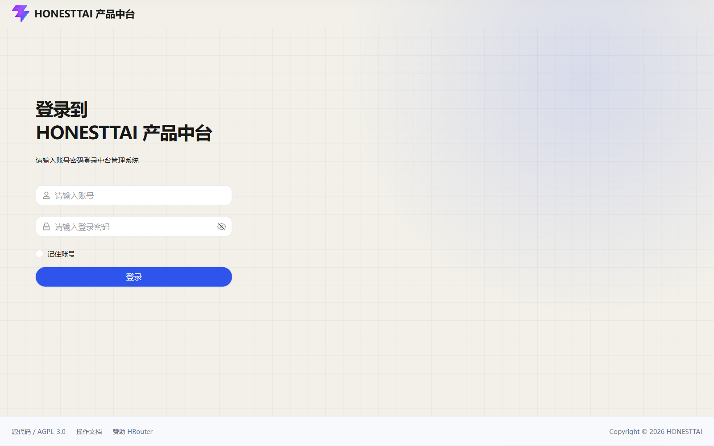

| 控件 | 操作与结果 |
| --- | --- |
| 账号 | 填写初始化时建立的后台账号；初始管理员为 `admin`。 |
| 密码 | 填写初始化时设置的密码。密码输入框的眼睛图标切换明文/隐藏；清除图标清空输入。 |
| 记住选项 | 当前表单保留该选项，但不能据此假定浏览器会永久记住密码或延长服务端会话。 |
| 登录 | 两项不能为空；校验成功后进入原目标页或系统总览。失败时读取提示，核对账号请求状态、密码及网关连接。 |

截图中密码保持空白。登录后的右上角账号菜单可进入个人中心或退出；退出后再次访问受保护页面会回到统一登录。

## 2. 系统总览

路由：`/platform/overview`。

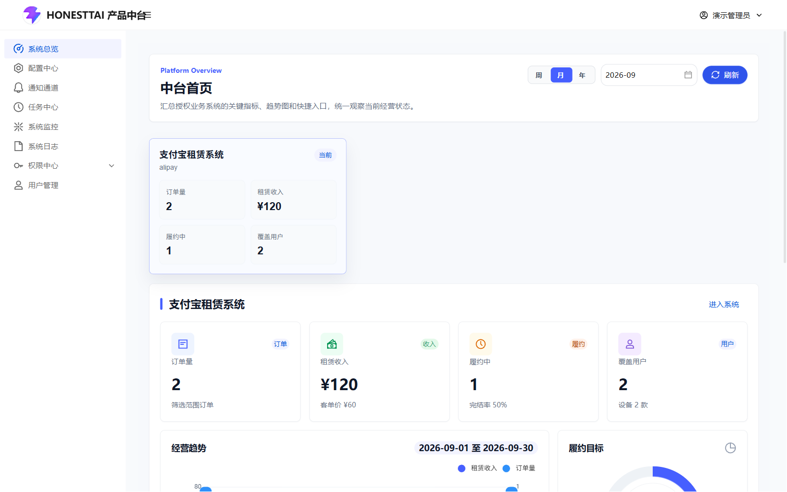

顶部“周 / 月 / 年”切换统计周期，日期选择器选择目标周期，“刷新”重新加载各系统看板。系统总览展示当前账号可以访问的系统、统计卡片和运行概况。点击系统选择卡片切换当前系统，卡片上的“当前/切换”表示选择状态；点击“进入系统”打开该系统入口。没有权限的入口不会因输入地址而获得访问权。业务统计依赖对应服务返回的数据；空统计不能证明交易能力已接通。

## 3. 配置中心

路由：`/platform/config`。

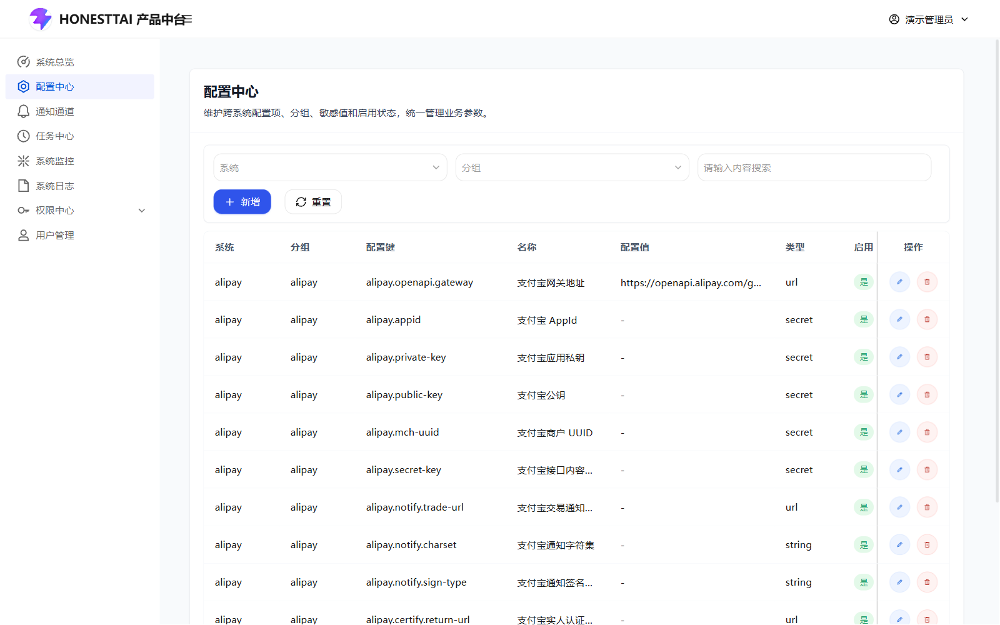

| 操作 | 步骤与作用 |
| --- | --- |
| 系统、分组、关键词 | 修改后自动查询并回到第一页；清除选择可扩大范围。关键词按服务端规则搜索配置。 |
| 重置 | 清空系统、分组和关键词，重新查询。 |
| 新增 | 打开空配置表单，填写下表后确认，再完成“操作确认”才保存。 |
| 编辑图标 | 打开该行配置，修改后确认，再完成“操作确认”；提交成功后列表刷新。 |
| 删除图标 | 在“操作确认”中确认后删除该配置并刷新列表，取消不删除。 |
| 疑似乱码标签 | 显示可恢复的文字，悬停查看原始文本；发现异常后检查原始编码，避免直接复制错误内容。 |

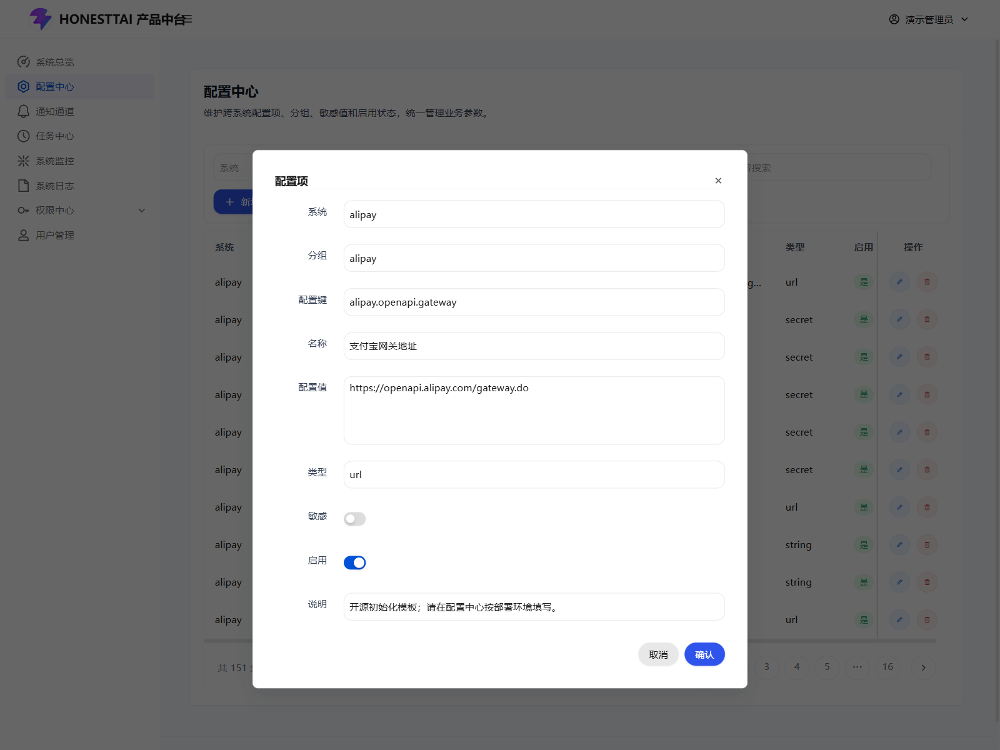

| 字段 | 填写说明 |
| --- | --- |
| 系统 | 使用已有系统编码，如 `common`、`platform`、`alipay`。 |
| 分组 | 用于列表筛选和组织参数。 |
| 配置键 | 与后端读取的键完全一致；系统与配置键一起定位配置。 |
| 名称 | 人可读的说明名称。 |
| 配置值 | 普通参数为多行文本；敏感参数为密码输入框；布尔参数显示开关。JSON 参数填写有效 JSON。 |
| 类型 | 与值对应，例如 `string`、`number`、`boolean`、`json`。 |
| 敏感 | 控制敏感值处理，密钥、令牌等应标记。不要把密钥写进名称或说明。 |
| 启用 | 决定该配置是否有效；禁用必需项可能导致业务读取失败。 |
| 说明 | 记录用途、格式和适用范围，不填写密钥。 |

编辑支付宝商品类目时可搜索类目名称或 ID 并点“查询”，再从候选中选择；租赁类目、商品成色和成色等级使用专用下拉框。类目候选依赖当前支付宝应用权限，不应把没有候选理解为已经支持任意类目。

支付宝、e签宝和代扣参数及先后次序见 [外部能力接入](INTEGRATIONS.md)。小程序 JWT 从中台 `alipay` 系统的 `miniapp.jwt.*` 读取；修改签名密钥会影响现有会话。配置保存后还要考虑读取缓存刷新时间。

## 4. 通知通道

路由：`/platform/notify`。

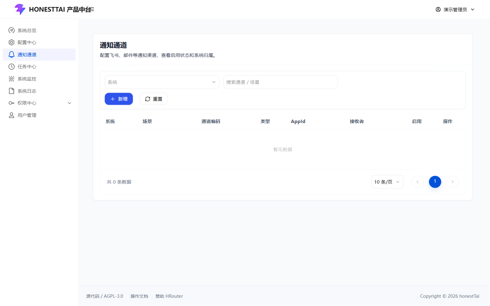

系统和“搜索通道/场景”修改后自动查询；“重置”清空条件。点击“新增”建立通道，“编辑”修改当前行；点击“删除”后在“操作确认”中确认才删除并刷新，取消不删除。页面没有发送测试通知按钮。

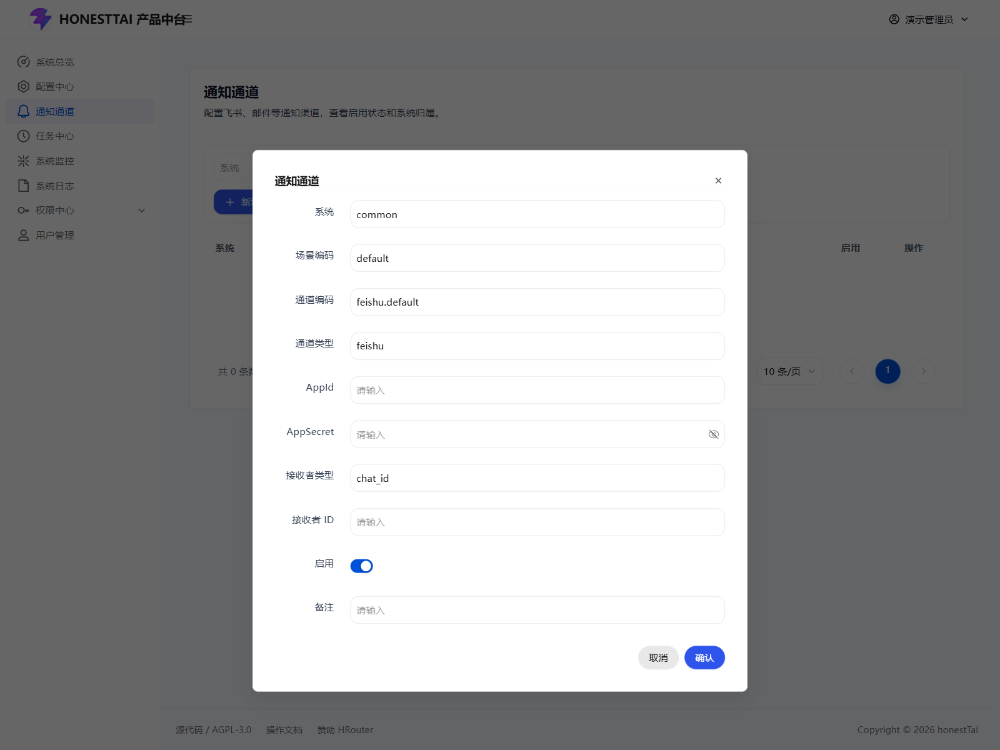

| 字段 | 填写与作用 |
| --- | --- |
| 系统 | 填负责通知的系统编码；共用通道可按实际配置使用 `common`。 |
| 场景编码 | 业务发送通知时用于匹配通知场景。 |
| 通道编码 | 区分同场景下的通道配置，如本地示例 `feishu.default`。 |
| 通道类型 | 选择代码已实现的类型；当前表单默认填写飞书 `feishu`。 |
| AppId | 通知应用标识。 |
| AppSecret | 通知应用凭证，输入隐藏；演示时留空。 |
| 接收者类型 | 对应消息 API 的标识类型，表单默认 `chat_id`。 |
| 接收者 ID | 与上述类型对应的接收对象；演示时不填写真实群/人员标识。 |
| 启用 | 控制配置是否可被使用。 |
| 备注 | 说明用途，不填写凭证。 |

表单点“确认”后还需在“操作确认”中确认，保存成功后刷新列表；任一步“取消/关闭”都不提交本次保存。保存配置不代表通知已成功发送，还需要应用权限、接收对象可达以及业务通知开关。

## 5. 任务中心

路由：`/platform/task`。

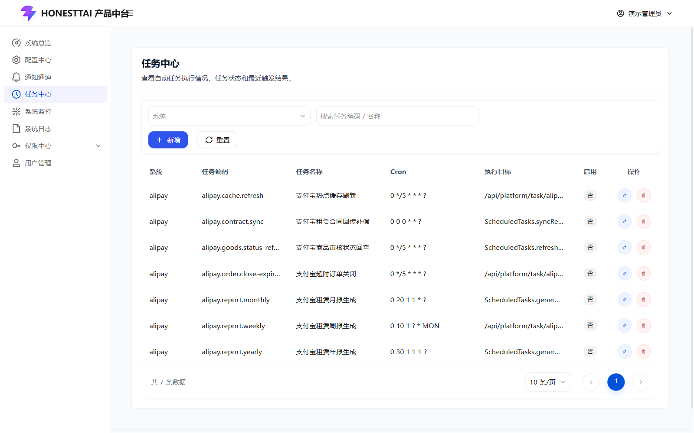

系统、任务编码/名称关键词自动查询；“重置”清空条件。“新增/编辑”打开任务配置，“删除”在“操作确认”中确认后删除记录。页面没有“立即执行”按钮。

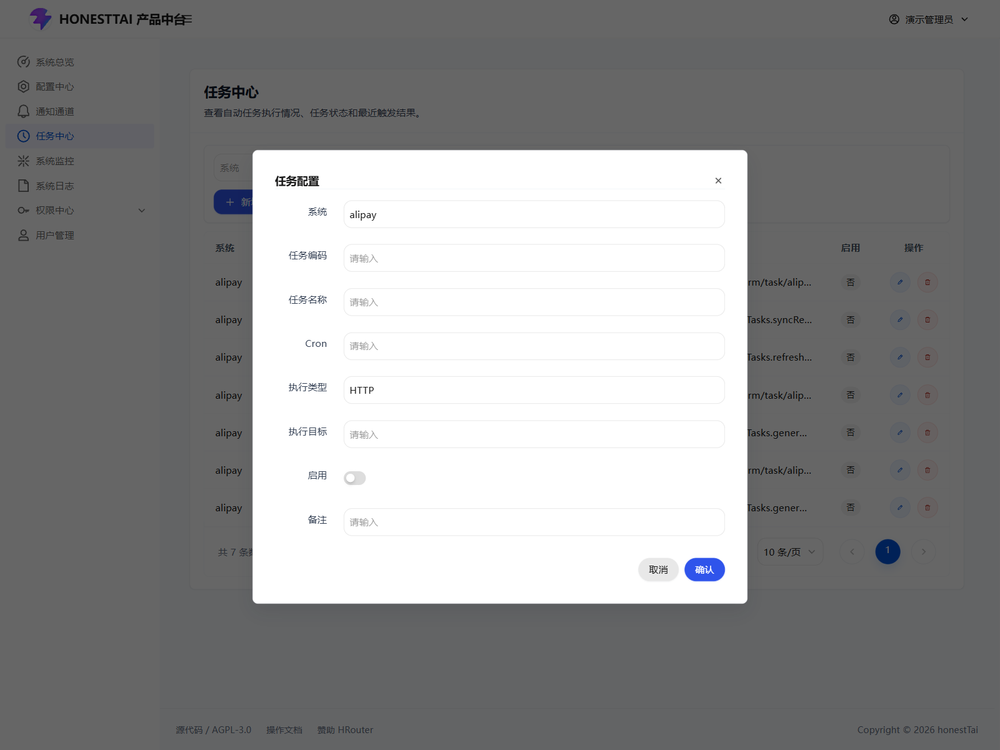

| 字段 | 填写与作用 |
| --- | --- |
| 系统 | 任务所属系统编码，新建默认为 `alipay`。 |
| 任务编码 | 调度程序识别的任务标识，与已实现任务匹配。 |
| 任务名称 | 用于列表识别的人可读名称。 |
| Cron | 执行周期表达式，必须符合当前后端调度规则与时区。 |
| 执行类型 | 与已实现执行器类型匹配，不是任意脚本语言。 |
| 执行目标 | 对应现有程序中的任务入口。 |
| 启用 | 新建默认关闭；开始/停止参与调度，开启已有任务可能产生实际业务请求。 |
| 备注 | 说明作用和依赖。 |

截图为未保存的新增表单：系统默认 `alipay`，启用开关默认关闭。先确认已实现的执行目标和调度参数，再按需启用；演示环境不保存启用任务。表单点“确认”后再完成统一“操作确认”才保存配置，点“取消/关闭”放弃。仅新增一条任意编码和目标不会自动创建一段可执行程序。内置任务用于售后、账单、合同等同步及报表生成，实际执行还依赖租赁服务运行、任务开关、外部服务参数和时区。截图只查看配置，不启用或执行付款/扣款任务。

## 6. 系统监控

路由：`/platform/monitor`。

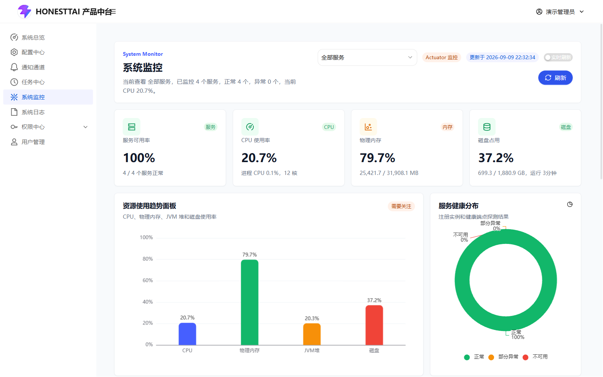

“选择监控服务”切换监控对象并加载数据；“刷新”立即读取一次；“实时刷新”打开/关闭定时读取。更新时间、监控模式和健康标签帮助判断数据是否可用。资源趋势、健康分布、资源使用、实例明细和内存结构用于定位异常；图表悬停查看数值。此页没有重启、部署或删除服务按钮。

实例明细中的响应时间、CPU、内存可能因监控来源不可达而为空。先看模式说明和健康状态，再分析资源占用，不把缺失值当成零。

## 7. 系统日志

路由：`/platform/logs`。

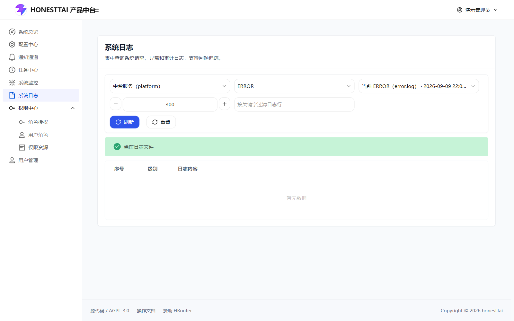

1. 选择系统和日志级别，页面重新获取相应日志文件；选择当前或归档文件。
2. 读取行数支持 50—1000，步进为 50；填写关键词后点击“刷新”读取匹配的日志行。
3. “重置”恢复查询条件并重新加载；日志表按序号、级别、内容查看。
4. “日志文件不存在”表示文件或挂载不可用，先核对服务是否写日志及中台可读的目录映射。

本页读取服务运行日志；订单业务台账在租赁后台的“台账管理”。分享排错信息前移除个人资料、令牌和业务敏感值。

## 8. 角色授权

路由：`/platform/rbac/roles`。

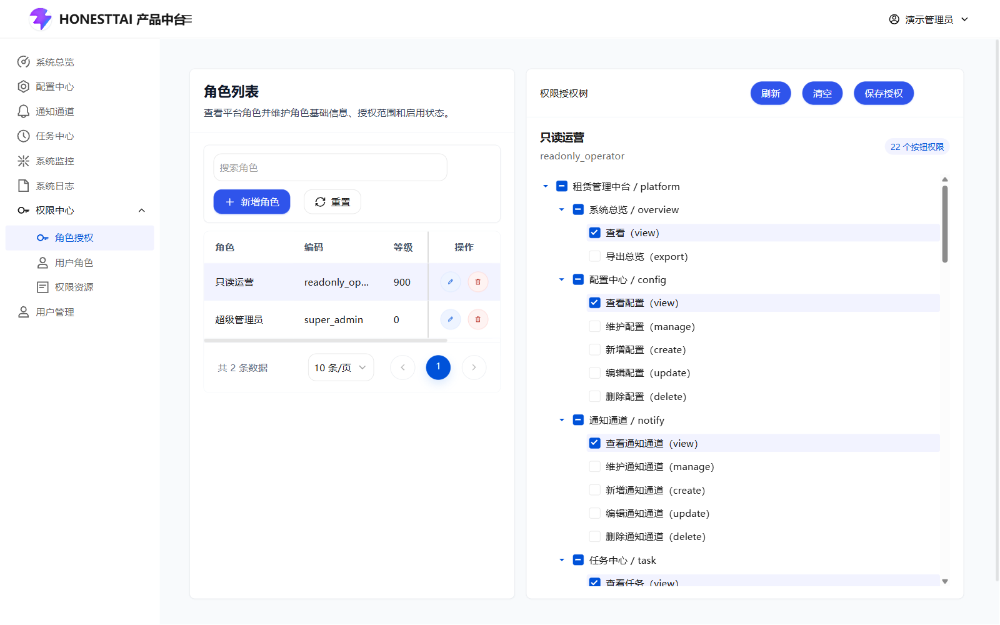

| 操作 | 结果与限制 |
| --- | --- |
| 搜索角色、重置 | 筛选角色列表或恢复全部。 |
| 新增角色、编辑 | 填写角色编码、角色名称、角色等级、说明、启用后确认，再完成“操作确认”。编码和名称不能为空。 |
| 删除 | 内置角色按钮禁用，服务端同样拒绝删除；普通角色在“操作确认”中确认并通过权限检查后删除。 |
| 点击角色行 | 加载右侧权限授权树，顶部显示所选角色及已选按钮权限数量。 |
| 树节点勾选 | 调整当前草稿中的按钮权限，系统/页面为组织节点。 |
| 刷新 | 重新读取当前角色授权，放弃尚未保存的勾选变化。 |
| 清空 | 清空当前勾选；必须再点“保存授权”才提交。 |
| 保存授权 | 在“操作确认”中确认后提交当前权限，相关用户需重新登录以刷新授权。未选择角色时禁用。 |

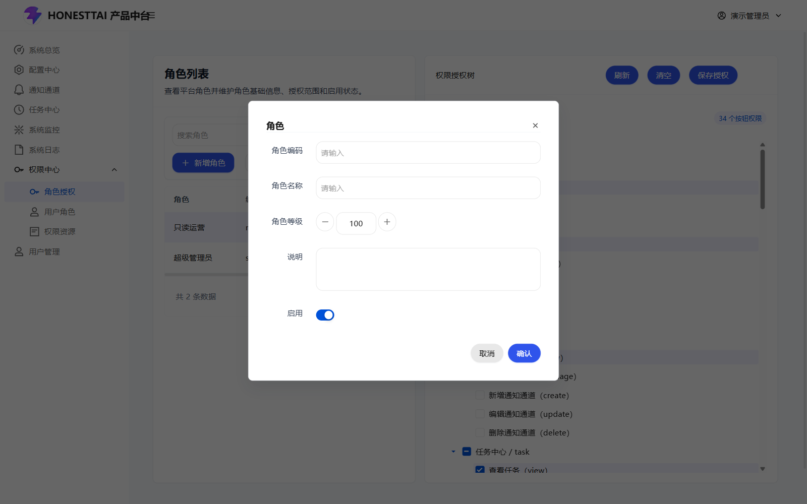

角色等级取值 1—9999，数字越小等级越高。后端限制普通管理者只能维护低于自己等级的角色，并限制可授予的角色；不能通过前端修改数字绕过。保存角色基础资料与保存授权是两个独立操作。

## 9. 用户角色

路由：`/platform/rbac/user-roles`。

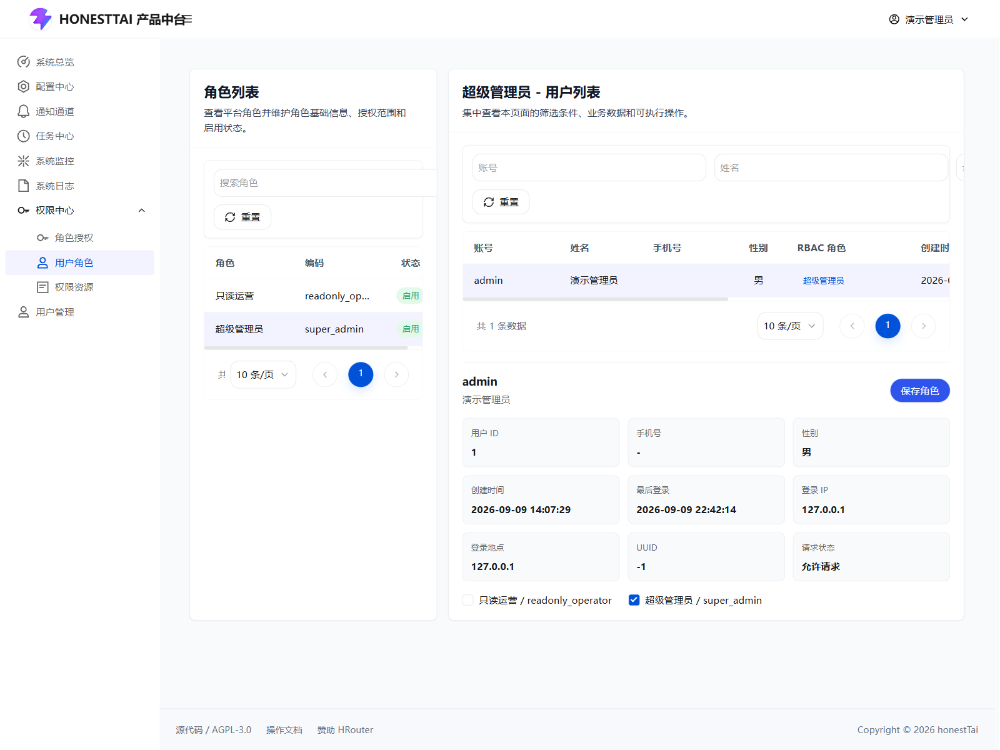

先在左侧搜索并选择角色，右侧显示该角色下的用户；右侧可按账号、姓名、最后登录地点筛选。左右两处“重置”分别重置对应查询。点击用户行后，下方出现用户资料和全部可分配角色复选框。勾选后点击“保存角色”，在“操作确认”中确认才提交该用户的整组绑定，取消不保存。停用角色无法勾选；已有资料为只读显示，不在这里修改账号和手机号。没有选择用户时不出现保存区。

## 10. 权限资源

路由：`/platform/rbac/resources`。

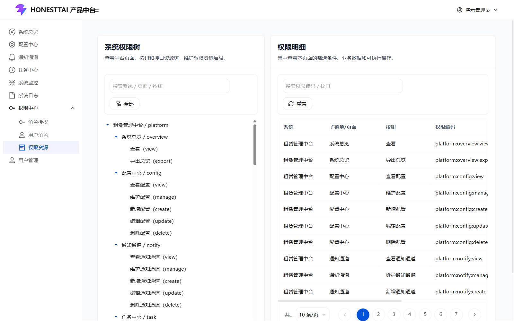

右侧表格较宽，横向滚动可查看 HTTP 方法和接口路径：

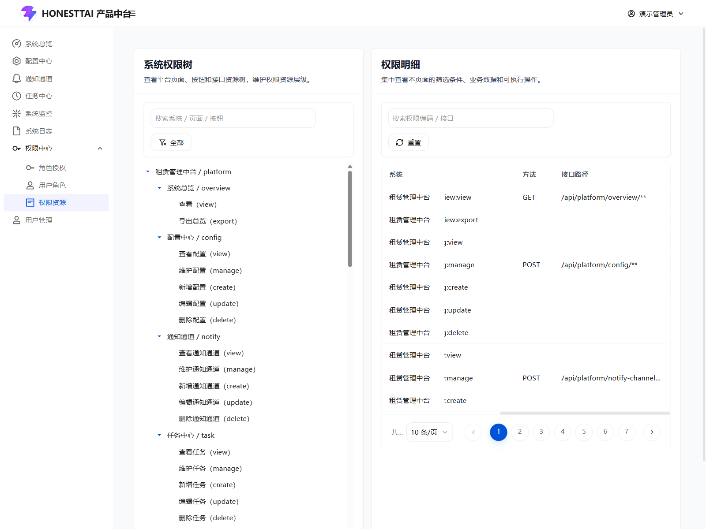

| 控件 | 使用方法 |
| --- | --- |
| 搜索系统 / 页面 / 按钮 | 筛选左侧系统权限树，定位需要核对的功能。 |
| 树节点 | 点击系统、页面或按钮，右侧显示对应范围的权限明细。树默认展开，可按节点折叠。 |
| 全部 | 清除已选节点和筛选约束，返回全量权限范围。 |
| 搜索权限编码 / 接口 | 按权限编码或 API 路径筛选明细。 |
| 重置 | 清除当前节点与搜索条件后重新加载。 |
| 分页 | 切换页码与每页条数，查看系统、页面、按钮、权限编码、HTTP 方法和接口路径。 |

这是只读资源清单，没有新增、编辑、删除资源按钮。角色授权页负责选择已有权限；新增业务 API 或按钮时，应由开发者同步维护权限资源及接口实现。

## 11. 后台用户管理

路由：`/platform/user`。

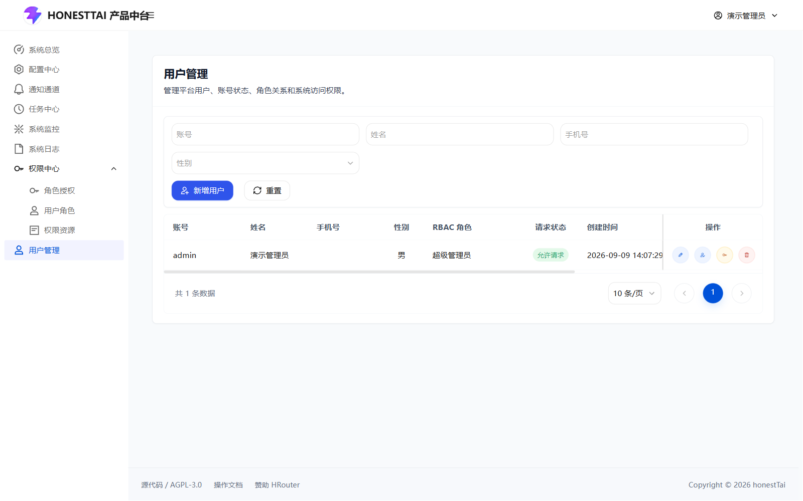

账号、姓名、手机号、性别筛选会自动查询；“重置”清空条件。新增、编辑、授权、重置密码、删除五种能力各自受按钮权限控制。

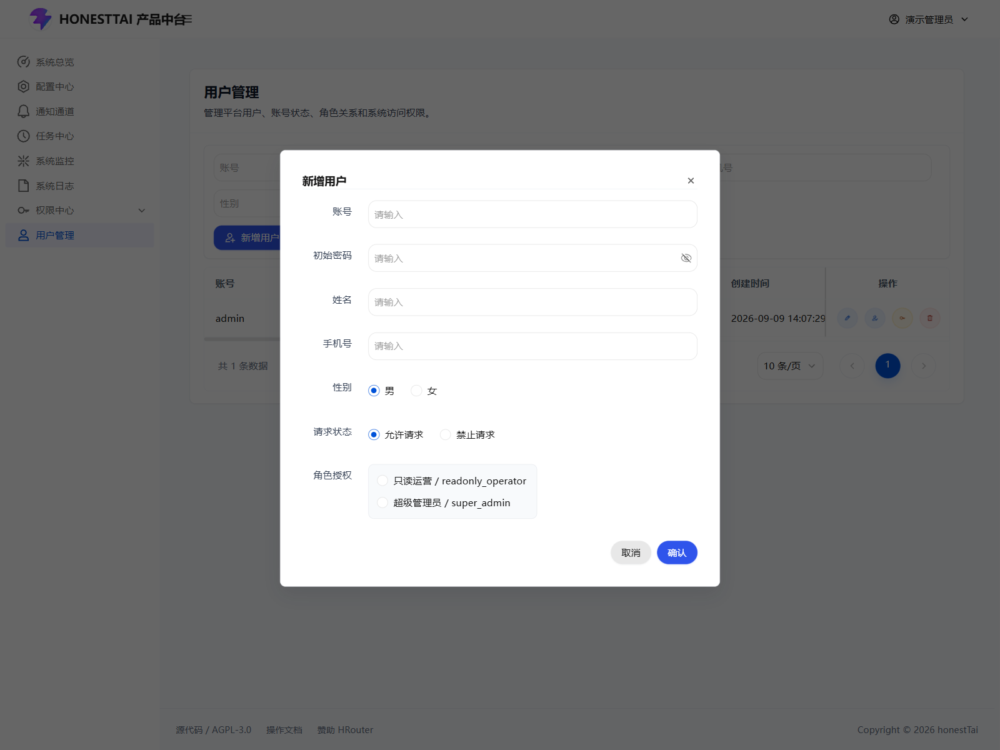

| 操作/弹窗 | 字段与结果 |
| --- | --- |
| 新增用户 | 账号、初始密码、姓名、手机号、性别、请求状态；有授权权限时还显示角色勾选。账号和初始密码不能为空；表单确认后还需完成“操作确认”。 |
| 编辑用户 | 账号只读且不显示初始密码；修改姓名、手机号、性别、请求状态及允许的角色，表单确认后还需完成“操作确认”。 |
| 请求状态 | “允许请求”供正常访问；“禁止请求”限制该账号。不要与角色停用混淆。 |
| 授权 | 账号、姓名只读，修改角色复选框后确认；停用角色不可选。 |
| 重置密码 | 账号只读，输入新密码后确认，再完成“操作确认”；旧登录状态失效，用户需重新登录。 |
| 删除 | 在“操作确认”中确认后删除该账号并失效相关登录状态，取消不删除。 |

编辑或授权成功的提示会说明相关登录状态已失效。后台用户用于员工登录；小程序用户由支付宝登录链路建立，两者不要混用。

## 12. 个人中心

路由：`/platform/profile`；从右上角账号菜单进入，侧栏默认隐藏。

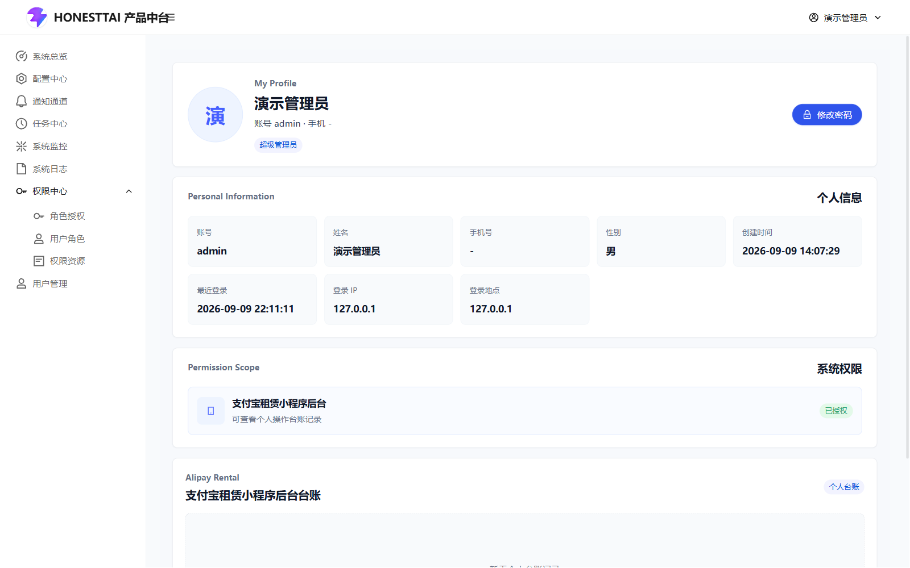

页面只读展示个人资料、角色、系统授权和有权限的个人业务台账。“修改密码”是主要操作入口。

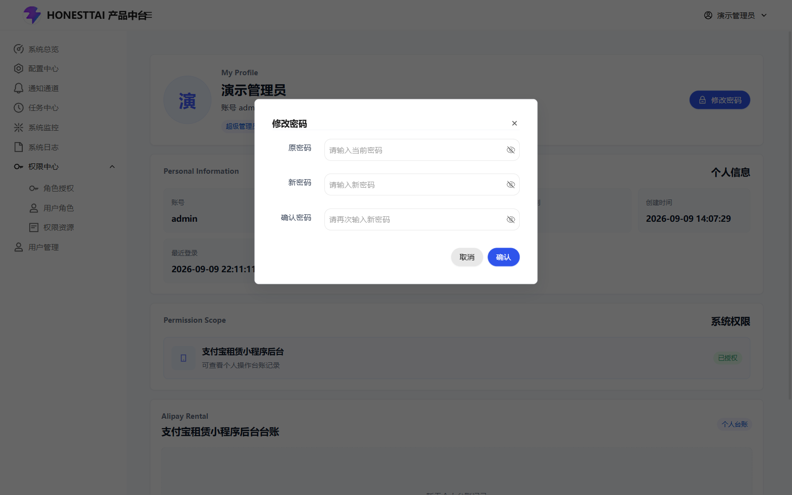

填写原密码、新密码、确认密码。三项必须完整，新密码至少 6 位且两次一致；“确认”提交，“取消/关闭”退出。成功后重新登录。无法提供原密码时，应由有权限的管理员在用户管理执行重置，不在这里跳过原密码。

## 源码核对

本分册依据 [中台路由](../../equipment_management_system_fornt/apps/platform-tdesign/src/router/modules/platform.ts)、对应 `src/pages/platform/` 组件、[角色权限服务](../../equipment-platform/src/main/java/com/equipment/platform/rbac/RbacService.java) 和 [用户服务](../../equipment-platform/src/main/java/com/equipment/platform/user/PlatformUserService.java)。界面没有声明的测试发送、立即执行、部署或强制授权操作不属于本手册步骤。
